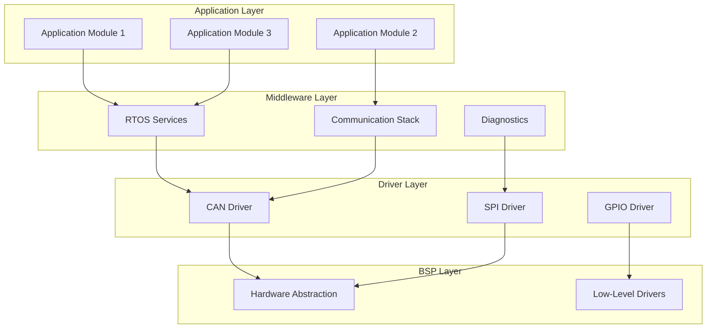
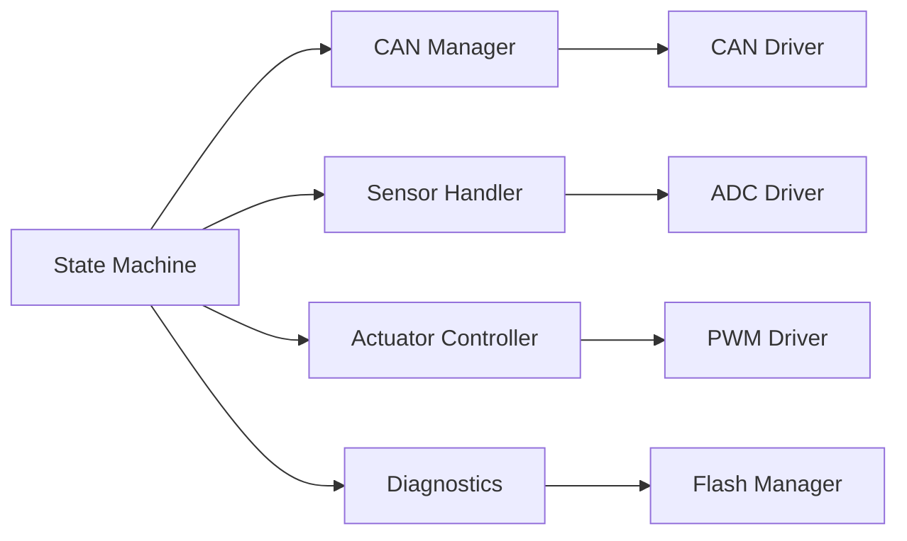
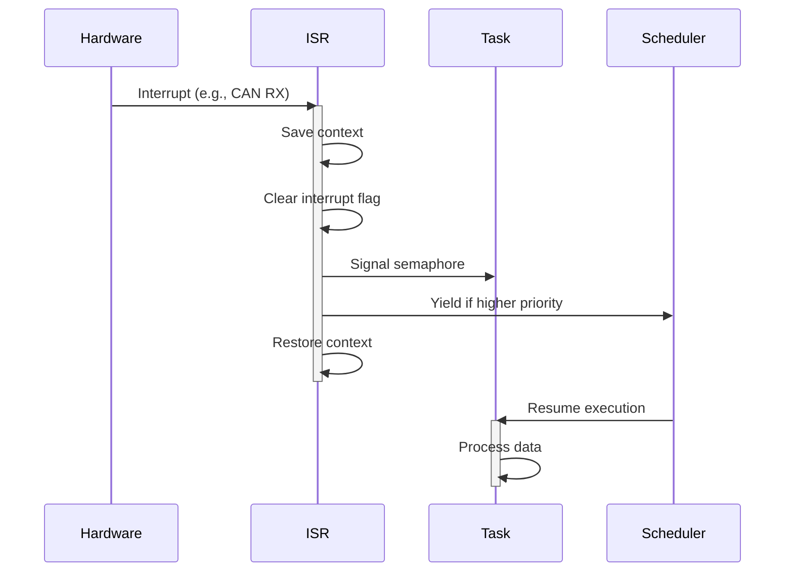
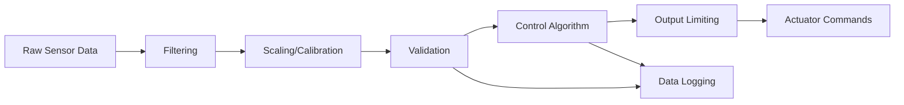

# Software Architecture

This document consolidates the software architecture of Network Intrusion detection project 

_Last updated: {{ git_revision_date_localized }}_

-----

[TOC]

## Software Architecture Pattern

Overall architectural style and design patterns used in the software system.

### Architecture Style
**Pattern:** Layered Architecture / Event-Driven / Microkernel / State Machine-based / Hybrid

**Description:** Brief explanation of the chosen architectural pattern and why it fits this system.

**Key Characteristics:**
- Characteristic 1 (e.g., separation of concerns)
- Characteristic 2 (e.g., real-time event processing)
- Characteristic 3 (e.g., modularity and reusability)

### Architectural Diagram



### Design Patterns Used
- **Pattern 1:** Observer/Publish-Subscribe for event handling
- **Pattern 2:** State Machine for control logic
- **Pattern 3:** Singleton for resource managers
- **Pattern 4:** Strategy for algorithm selection
- **Pattern 5:** Factory for object creation

---

## Layer/Module Decomposition

Breakdown of software into layers and modules.

### Layer Structure


### Layer Descriptions

#### Application Layer
**Purpose:** Business logic and application-specific functionality

**Modules:**
- **Module 1:** Vehicle control algorithms
- **Module 2:** User interface management
- **Module 3:** Data processing and filtering

**Dependencies:** Service layer, ECU abstraction layer

---

#### Service/Middleware Layer
**Purpose:** RTOS and common services

**Modules:**
- **RTOS Kernel:** Task scheduling, synchronization (FreeRTOS/Zephyr/etc.)
- **Memory Manager:** Heap management, buffer pools
- **Communication Manager:** Protocol handling, message routing
- **Diagnostic Services:** Error logging, diagnostics protocol

**Dependencies:** ECU abstraction layer

---

#### ECU Abstraction Layer
**Purpose:** Hardware-independent interface to peripherals

**Modules:**
- **CAN Interface:** Abstract CAN communication
- **ADC Interface:** Abstract analog input
- **PWM Interface:** Abstract pulse-width modulation
- **Timer Interface:** Abstract timing services

**Dependencies:** MCAL layer

---

#### MCAL (Microcontroller Abstraction Layer)
**Purpose:** Hardware-specific drivers

**Modules:**
- **CAN Driver:** Low-level CAN controller
- **ADC Driver:** Low-level ADC control
- **GPIO Driver:** Low-level digital I/O
- **SPI/I2C Driver:** Low-level serial communication

**Dependencies:** Hardware registers

---

#### Complex Device Drivers
**Purpose:** External device drivers

**Modules:**
- **Sensor Driver:** Sensor-specific protocol (e.g., I2C sensor)
- **Actuator Driver:** Actuator control logic

**Dependencies:** MCAL layer

---

## Component Overview

List of major software components and their responsibilities.

| Component Name | Layer | Responsibility | Key Interfaces |
|----------------|-------|----------------|----------------|
| Task Manager | Service | Task scheduling, context switching | task_create(), task_delete() |
| CAN Manager | Service | CAN message handling | can_send(), can_receive() |
| State Machine | Application | System state management | sm_transition(), sm_get_state() |
| Sensor Handler | Application | Sensor data acquisition | sensor_read(), sensor_calibrate() |
| Actuator Controller | Application | Actuator control | actuator_set(), actuator_get_status() |
| Diagnostics | Service | Error handling, logging | diag_log_error(), diag_get_dtc() |
| Flash Manager | Service | Non-volatile memory access | flash_write(), flash_read() |

### Component Dependencies



---

## Static View

Software package structure, modules, and dependencies.

### Package Structure
```
project_root/
├── src/
│   ├── app/
│   │   ├── control/
│   │   │   ├── state_machine.c
│   │   │   └── control_logic.c
│   │   ├── sensors/
│   │   │   └── sensor_handler.c
│   │   └── actuators/
│   │       └── actuator_controller.c
│   ├── middleware/
│   │   ├── rtos/
│   │   ├── comm/
│   │   │   └── can_manager.c
│   │   └── diag/
│   │       └── diagnostics.c
│   ├── drivers/
│   │   ├── can/
│   │   ├── adc/
│   │   ├── gpio/
│   │   └── spi/
│   └── bsp/
│       ├── board_init.c
│       └── system_config.c
├── inc/
│   ├── app/
│   ├── middleware/
│   ├── drivers/
│   └── bsp/
├── config/
│   └── system_config.h
└── tests/
    └── unit_tests/
```

### Module Dependencies


### Key Interfaces and APIs

#### Application APIs
```c
// State machine
void sm_init(void);
state_t sm_get_current_state(void);
void sm_transition(event_t event);

// Sensor interface
status_t sensor_init(sensor_id_t id);
float sensor_read(sensor_id_t id);
```

#### Middleware APIs
```c
// RTOS
task_handle_t task_create(task_func_t func, void* param, priority_t prio);
void task_delay(uint32_t ms);

// CAN Manager
status_t can_send_message(can_msg_t* msg);
status_t can_register_callback(can_id_t id, can_callback_t cb);
```

#### Driver APIs
```c
// Low-level driver interface
void can_driver_init(can_config_t* config);
void adc_driver_start_conversion(uint8_t channel);
uint16_t adc_driver_get_result(void);
```

---

## Runtime View

Task/thread architecture, execution flow, and real-time scheduling.

### Task Architecture

| Task Name | Priority | Period/Trigger | Stack Size | Responsibility |
|-----------|----------|----------------|------------|----------------|
| Control Task | High (3) | 10 ms periodic | 2 KB | Main control loop |
| CAN RX Task | High (2) | Event (CAN msg) | 1 KB | CAN message reception |
| Sensor Task | Medium (5) | 50 ms periodic | 1.5 KB | Sensor data acquisition |
| Diagnostic Task | Low (8) | 100 ms periodic | 1 KB | System monitoring |
| Idle Task | Lowest (15) | Always ready | 512 B | Power management |

### Task Scheduling Diagram

```mermaid
gantt
    title Task Execution Timeline (100ms window)
    dateFormat X
    axisFormat %L
    
    section Control Task
    Run :0, 2
    Run :10, 12
    Run :20, 22
    Run :30, 32
    Run :40, 42
    Run :50, 52
    Run :60, 62
    Run :70, 72
    Run :80, 82
    Run :90, 92
    
    section CAN RX Task
    Process :5, 6
    Process :25, 26
    Process :65, 66
    
    section Sensor Task
    Read :0, 4
    Read :50, 54
    
    section Diagnostic
    Check :0, 3
```



### Runtime Sequence


### State Machine Execution


### Interrupt Handling



### Timing Constraints

| Constraint | Value | Consequence if Violated |
|------------|-------|------------------------|
| Control loop execution time | < 8 ms | Missed deadline alarm |
| CAN message latency | < 5 ms | Communication timeout |
| Sensor read response time | < 2 ms | Stale data warning |
| Maximum interrupt latency | < 100 µs | Real-time violation |
| Context switch time | < 10 µs | Scheduling overhead |

---

## Data Flow

How data moves through the software system.

### Data Flow Diagram


### Data Processing Pipeline



### Data Stores

| Data Store | Type | Size | Persistence | Purpose |
|-----------|------|------|-------------|---------|
| Sensor Buffer | Ring buffer | 256 bytes | RAM | Recent sensor values |
| CAN TX Queue | FIFO queue | 512 bytes | RAM | Outgoing CAN messages |
| CAN RX Queue | FIFO queue | 512 bytes | RAM | Incoming CAN messages |
| Configuration | Struct | 128 bytes | Flash | System parameters |
| Calibration Data | Array | 1 KB | Flash | Sensor calibration |
| Diagnostic Log | Ring buffer | 2 KB | Flash | Error history |

---

## Inter-Component Communication

Communication mechanisms between software components.

### Communication Mechanisms

| Mechanism | Use Case | Components Involved | Synchronization |
|-----------|----------|---------------------|-----------------|
| Direct Function Call | Same layer interaction | Control → Sensor Handler | Synchronous |
| Message Queue | Task-to-task async | CAN RX Task → Control Task | Asynchronous |
| Semaphore | Resource protection | Multiple → Flash Manager | Blocking |
| Event Flags | Notification | ISR → Task | Asynchronous |
| Shared Memory | High-speed data | Sensor Task → Control Task | Mutex-protected |
| Callback Functions | Event notification | Driver → Application | Asynchronous |

### Communication Patterns

#### Message Queue Example
```c
// Producer (CAN RX Task)
can_msg_t msg;
if (can_receive(&msg)) {
    queue_send(rx_queue, &msg, TIMEOUT_MS);
}

// Consumer (Control Task)
can_msg_t msg;
if (queue_receive(rx_queue, &msg, TIMEOUT_MS)) {
    process_can_message(&msg);
}
```

#### Callback Example
```c
// Registration
can_register_callback(CAN_ID_CMD, on_command_received);

// Callback implementation
void on_command_received(can_msg_t* msg) {
    // Process command
    event_flags_set(CMD_EVENT_FLAG);
}
```

### Data Sharing and Protection


---

## Memory Architecture

Flash and RAM layout, code placement, and memory management.

### Memory Map

```
Flash Memory (1 MB)
┌─────────────────────────────────┐ 0x0800 0000
│ Bootloader (64 KB)              │
├─────────────────────────────────┤ 0x0801 0000
│ Application Code (768 KB)       │
│  - Vector Table                 │
│  - Application Layer            │
│  - Middleware Layer             │
│  - Driver Layer                 │
├─────────────────────────────────┤ 0x080D 0000
│ Calibration Data (128 KB)       │
├─────────────────────────────────┤ 0x080F 0000
│ Configuration (32 KB)           │
├─────────────────────────────────┤ 0x080F 8000
│ Diagnostic Log (32 KB)          │
└─────────────────────────────────┘ 0x0810 0000

RAM Memory (128 KB)
┌─────────────────────────────────┐ 0x2000 0000
│ Stack (16 KB)                   │
├─────────────────────────────────┤ 0x2000 4000
│ Heap (32 KB)                    │
├─────────────────────────────────┤ 0x2000 C000
│ .bss (Uninitialized) (16 KB)   │
├─────────────────────────────────┤ 0x2001 0000
│ .data (Initialized) (8 KB)      │
├─────────────────────────────────┤ 0x2001 2000
│ Task Stacks (24 KB)             │
│  - Control Task: 2 KB           │
│  - CAN RX Task: 1 KB            │
│  - Sensor Task: 1.5 KB          │
│  - Others...                    │
├─────────────────────────────────┤ 0x2001 8000
│ Buffers & Queues (16 KB)        │
│  - CAN TX/RX buffers            │
│  - Sensor data buffers          │
├─────────────────────────────────┤ 0x2001 C000
│ RTOS Kernel Data (16 KB)        │
└─────────────────────────────────┘ 0x2002 0000
```

### Linker Section Placement

| Section | Memory Region | Size | Purpose |
|---------|---------------|------|---------|
| `.isr_vector` | Flash 0x08000000 | 1 KB | Interrupt vectors |
| `.text` | Flash | ~500 KB | Application code |
| `.rodata` | Flash | ~50 KB | Constant data |
| `.data` | RAM (load from Flash) | 8 KB | Initialized variables |
| `.bss` | RAM | 16 KB | Uninitialized variables |
| `.heap` | RAM | 32 KB | Dynamic allocation |
| `.stack` | RAM | 16 KB | Main stack |
| `.calibration` | Flash 0x080D0000 | 128 KB | Calibration data |

### Memory Budget

**Flash Usage:**
- Total available: 1024 KB
- Bootloader: 64 KB (6%)
- Application code: 768 KB (75%)
- Calibration: 128 KB (12.5%)
- Configuration: 32 KB (3%)
- Diagnostic log: 32 KB (3%)
- **Reserved/Free: 0 KB (0%)**

**RAM Usage:**
- Total available: 128 KB
- Stack: 16 KB (12.5%)
- Heap: 32 KB (25%)
- Static data (.bss + .data): 24 KB (18.75%)
- Task stacks: 24 KB (18.75%)
- Buffers: 16 KB (12.5%)
- RTOS: 16 KB (12.5%)
- **Free: ~0 KB**

### Memory Management Strategy

**Static Allocation:**
- All task stacks: compile-time sized
- Critical buffers: statically allocated
- No fragmentation risk

**Dynamic Allocation:**
- Heap used sparingly for non-critical objects
- Memory pools for fixed-size objects
- Diagnostics: heap usage monitoring

**Memory Protection (if MPU available):**
- Region 1: Flash (read-only, executable)
- Region 2: RAM (read-write, non-executable)
- Region 3: Peripherals (read-write, non-executable)
- Region 4: Stack guard (no access)

---

## Boot Sequence

System initialization and startup flow.

### Boot Flow Diagram


### Initialization Sequence Details

#### Stage 1: Hardware Initialization (Reset Handler)
```c
void Reset_Handler(void) {
    // 1. Copy .data section from Flash to RAM
    memcpy(&_sdata, &_sidata, &_edata - &_sdata);
    
    // 2. Zero .bss section
    memset(&_sbss, 0, &_ebss - &_sbss);
    
    // 3. Call system init
    SystemInit();
    
    // 4. Jump to main
    main();
}
```

#### Stage 2: System Initialization
```c
void SystemInit(void) {
    // Clock configuration (PLL, AHB, APB)
    clock_config();
    
    // Enable FPU (if applicable)
    fpu_enable();
    
    // Configure vector table offset
    SCB->VTOR = FLASH_BASE;
    
    // Enable fault handlers
    fault_handlers_enable();
}
```

#### Stage 3: BSP Initialization
```c
void bsp_init(void) {
    // GPIO initialization
    gpio_init();
    
    // Enable peripheral clocks
    peripheral_clocks_enable();
    
    // External memory controller (if used)
    memory_controller_init();
}
```

#### Stage 4: Driver Initialization
```c
void drivers_init(void) {
    can_driver_init(&can_config);
    adc_driver_init(&adc_config);
    timer_driver_init(&timer_config);
    spi_driver_init(&spi_config);
    // ... other drivers
}
```

#### Stage 5: Application Initialization
```c
int main(void) {
    // Load configuration from Flash
    config_load();
    
    // Initialize middleware
    rtos_init();
    can_manager_init();
    diagnostics_init();
    
    // Initialize application components
    state_machine_init();
    sensor_handler_init();
    actuator_controller_init();
    
    // Create RTOS tasks
    task_create(control_task, NULL, HIGH_PRIORITY);
    task_create(sensor_task, NULL, MEDIUM_PRIORITY);
    task_create(diagnostic_task, NULL, LOW_PRIORITY);
    
    // Start scheduler (never returns)
    rtos_start_scheduler();
    
    // Should never reach here
    while(1);
}
```

### Initialization Timing

| Stage | Duration | Notes |
|-------|----------|-------|
| Reset to SystemInit | ~100 µs | Hardware-dependent |
| Clock configuration | ~5 ms | PLL stabilization |
| BSP initialization | ~10 ms | GPIO, peripherals |
| Driver initialization | ~20 ms | CAN, ADC, timers |
| Application init | ~50 ms | Config load, RTOS setup |
| **Total boot time** | **~85 ms** | To scheduler start |

### Watchdog Handling During Boot
- Watchdog started early in boot
- Periodic kicks during long initialization
- Fully handed over to application after boot

---

## Error Handling Strategy

System-wide approach to error detection, reporting, and recovery.

### Error Classification

| Error Level | Severity | Example | Response |
|-------------|----------|---------|----------|
| Critical | ASIL-D | Sensor total failure | Enter safe state, disable system |
| Error | ASIL-B | CAN communication timeout | Switch to backup, log DTC |
| Warning | ASIL-A | Sensor value out of range | Use default, log warning |
| Info | QM | Configuration updated | Log event |

### Error Detection Mechanisms

**Hardware-Level:**
- Watchdog timer (independent)
- Memory parity/ECC (if available)
- Clock monitoring (LSI/HSE failure detection)
- Stack overflow detection
- Peripheral error flags

**Software-Level:**
- Return code checking
- Plausibility checks on sensor data
- Timeout monitoring on communication
- Sequence number validation
- CRC/checksum verification
- Range checking on inputs

### Error Handling Flow


### Error Recovery Strategies

| Error Type | Recovery Strategy | Fallback |
|------------|------------------|----------|
| CAN timeout | Retry 3 times, then use last valid | Enter limp mode |
| Sensor failure | Use redundant sensor or default | Safe state |
| Memory corruption | Reset affected subsystem | Full system reset |
| Task watchdog violation | Reset task, log event | System reset if repeated |
| Configuration error | Load defaults | Halt if critical |

### Diagnostic Trouble Codes (DTC)

```c
typedef enum {
    DTC_NO_ERROR = 0x0000,
    
    // Communication errors (0x1xxx)
    DTC_CAN_BUS_OFF = 0x1001,
    DTC_CAN_TIMEOUT = 0x1002,
    
    // Sensor errors (0x2xxx)
    DTC_SENSOR_1_FAULT = 0x2001,
    DTC_SENSOR_OUT_OF_RANGE = 0x2002,
    
    // Actuator errors (0x3xxx)
    DTC_ACTUATOR_FAULT = 0x3001,
    
    // System errors (0x4xxx)
    DTC_WATCHDOG_RESET = 0x4001,
    DTC_STACK_OVERFLOW = 0x4002,
    DTC_MEMORY_CORRUPTION = 0x4003,
    
} dtc_code_t;
```

### Error Logging

**Log Entry Format:**
```c
typedef struct {
    uint32_t timestamp;      // System time
    dtc_code_t dtc;          // Error code
    uint8_t severity;        // Critical/Error/Warning/Info
    uint32_t context[4];     // Context-specific data
} error_log_entry_t;
```

**Log Storage:**
- Ring buffer in Flash (2 KB, ~50 entries)
- Persistent across resets
- Accessible via diagnostics interface

### Safe State Definition

**Safe State Actions:**
1. Disable all actuators (set to known safe position)
2. Set safe state flag in persistent memory
3. Enable error LED/indicator
4. Log critical error with context
5. Wait for manual reset or external intervention

**Recovery from Safe State:**
- Requires explicit user action or diagnostic command
- Verify error condition cleared
- Perform self-test before resuming

---

## Key Design Decisions

Major software architectural choices and rationale.

### Decision 1: RTOS Selection
**Context:** Need for multitasking and real-time scheduling

**Decision:** Use FreeRTOS / Zephyr / Custom RTOS

**Rationale:**
- Proven in automotive applications
- Small footprint suitable for resource-constrained MCU
- Active community and support
- Permissive license
- Pre-certified for safety (if applicable)

**Consequences:**
- Task-based architecture required
- Additional RAM overhead for task stacks
- Deterministic scheduling achieved

**Trade-offs:**
- Learning curve for team
- Slightly increased complexity vs. bare-metal

---

### Decision 2: Communication Protocol
**Context:** Inter-ECU communication requirement

**Decision:** Use CAN bus with custom protocol / CANopen / J1939

**Rationale:**
- Industry standard for automotive
- Robust error detection
- Broadcast and multicast support
- Wide hardware support

**Consequences:**
- Need CAN transceiver hardware
- Protocol stack implementation required
- Bandwidth limitations (500 kbps / 1 Mbps)

**Trade-offs:**
- Higher latency vs. point-to-point
- Limited payload (8 bytes per message)

---

### Decision 3: Memory Management
**Context:** Embedded system with limited RAM

**Decision:** Primarily static allocation with limited heap

**Rationale:**
- Deterministic behavior
- No fragmentation risk
- Predictable memory footprint
- Easier certification for safety

**Consequences:**
- Less flexibility at runtime
- Careful planning of buffer sizes required
- Some dynamic allocation for non-critical features

**Trade-offs:**
- May waste some memory vs. dynamic
- Configuration changes require recompilation

---

## Alternative Design Decisions

Software architecture alternatives evaluated and rejected.

### Alternative 1: Bare-Metal (No RTOS)
**Description:** Implement super-loop with interrupt-driven I/O instead of RTOS

**Pros:**
- Simpler, more predictable
- Lower memory overhead
- Easier debugging
- No licensing concerns

**Cons:**
- Harder to manage complex timing requirements
- Difficult to add new features
- Manual scheduling and prioritization
- Scalability issues as complexity grows

**Reason for Rejection:** 
System has multiple concurrent activities with different priorities and timing constraints. RTOS provides better separation of concerns and maintainability.

**When to Reconsider:** 
If system becomes very simple with only 1-2 periodic tasks and minimal event handling.

---

### Alternative 2: Event-Driven Architecture Only
**Description:** Pure event-driven system with event queue and handlers

**Pros:**
- Very responsive to events
- Lower context-switching overhead
- Simpler state management
- Good for highly asynchronous systems

**Cons:**
- Harder to guarantee timing for periodic tasks
- Complex priority management
- Potential for event queue overflow
- Debugging event chains is difficult

**Reason for Rejection:** 
System has both periodic control loops and asynchronous events. Hybrid approach (RTOS with event flags) provides better balance.

**When to Reconsider:** 
If system becomes predominantly event-driven with few periodic requirements.

---

### Alternative 3: Dynamic Memory Allocation
**Description:** Use heap extensively for buffers, objects, and data structures

**Pros:**
- Flexible resource allocation
- Can adapt to varying workload
- Less upfront memory planning
- Easier to implement variable-size structures

**Cons:**
- Fragmentation risk in long-running system
- Non-deterministic allocation time
- Harder to prove safety properties
- Potential for memory leaks

**Reason for Rejection:** 
Safety-critical automotive application requires deterministic behavior and predictable memory usage. Static allocation eliminates fragmentation and allocation failures.

**When to Reconsider:** 
If system moves to more powerful processor with MMU and is no longer safety-critical.

---

## Notes and References

### Development Tools
- **Compiler:** GCC ARM / Keil MDK / IAR EWARM
- **IDE:** STM32CubeIDE / VSCode / Eclipse
- **Debugger:** ST-Link / J-Link / OpenOCD
- **Static Analysis:** PC-Lint / Coverity / SonarQube
- **Version Control:** Git

### Coding Standards
- MISRA C:2012 compliance
- AUTOSAR Coding Guidelines (if applicable)
- Project-specific naming conventions
- Doxygen documentation format

### Related Documentation
- System Architecture Document
- Component Detailed Design Documents
- Software Requirements Specification
- Interface Control Documents
- Test Specification

### Revision History
| Version | Date | Author | Changes |
|---------|------|--------|---------|
| 0.1 | YYYY-MM-DD | [Name] | Initial draft |
