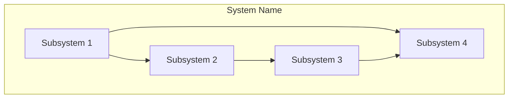
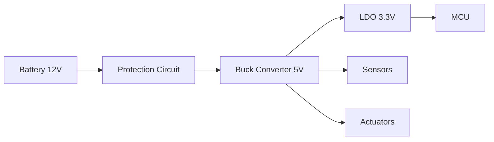

# System Architecture

This document consolidates the system architecture of Network Intrusion detection project 

_Last updated: {{ git_revision_date_localized }}_

-----

## System Decomposition

High-level decomposition of the system into major subsystems and their responsibilities.

### Subsystem Overview



### Subsystem Descriptions

#### Subsystem 1: [Name]
**Responsibility:** Brief description of what this subsystem does

**Key Functions:**
- Function 1
- Function 2
- Function 3

**Interfaces:** What it connects to

---

#### Subsystem 2: [Name]
**Responsibility:** Brief description of what this subsystem does

**Key Functions:**
- Function 1
- Function 2

**Interfaces:** What it connects to

---

#### Subsystem 3: [Name]
**Responsibility:** Brief description of what this subsystem does

**Key Functions:**
- Function 1
- Function 2

**Interfaces:** What it connects to

---

## Hardware Architecture

Physical hardware components, ECUs, sensors, actuators, and communication infrastructure.

### Hardware Block Diagram


### Hardware Components

| Component | Type | Specification | Interface | Purpose |
|-----------|------|---------------|-----------|---------|
| Main MCU | STM32F4xx / ESP32 / etc. | Clock, Flash, RAM | - | Main controller |
| Sensor 1 | Temperature/Pressure/etc. | Range, Accuracy | I2C/SPI/Analog | Sensing function |
| Actuator 1 | Motor/Relay/LED/etc. | Voltage, Current | PWM/GPIO | Control function |
| CAN Transceiver | TJA1050 / MCP2551 | Speed | CAN Bus | Communication |
| Power Supply | LDO/Buck/etc. | Input/Output voltage | - | Power management |

### Communication Buses

#### CAN Bus
- **Type:** CAN 2.0B / CAN-FD
- **Baud Rate:** 500 kbps / 1 Mbps
- **Topology:** Linear bus with termination
- **Nodes:** ECU1, ECU2, Sensor Module, etc.

#### Other Buses (I2C, SPI, UART, LIN)
- **I2C:** Clock speed, slave addresses
- **SPI:** Clock speed, CS pins
- **UART:** Baud rate, usage
- **LIN:** Baud rate, master/slave

### Power Architecture



**Power Budget:**
- Total power consumption: XX mA @ 12V
- MCU: XX mA
- Sensors: XX mA
- Actuators: XX mA
- Sleep mode: XX µA

---

## System Interfaces

External and internal interfaces between subsystems.

### External Interfaces

| Interface | Type | Protocol | Data Rate | Purpose |
|-----------|------|----------|-----------|---------|
| CAN Bus | Communication | CAN 2.0B | 500 kbps | Vehicle network |
| USB | Debug/Programming | USB 2.0 | 480 Mbps | Diagnostics |
| Analog Input | Sensor | 0-5V | - | Sensor reading |
| Digital I/O | Control | GPIO | - | Actuator control |

### Internal Interfaces


### Interface Specifications

#### Interface 1: [Name]
- **Type:** CAN / SPI / I2C / GPIO / etc.
- **Direction:** Subsystem A → Subsystem B
- **Protocol:** Detailed protocol description
- **Data Format:** Message structure, payload
- **Timing:** Periodic (rate) / Event-driven / On-demand
- **Error Handling:** CRC, timeout, retry mechanism

#### Interface 2: [Name]
- **Type:** CAN / SPI / I2C / GPIO / etc.
- **Direction:** Subsystem B → Subsystem C
- **Protocol:** Detailed protocol description
- **Data Format:** Message structure, payload
- **Timing:** Periodic (rate) / Event-driven / On-demand
- **Error Handling:** CRC, timeout, retry mechanism

---

## Deployment View

Mapping of software components to hardware nodes.

### Deployment Diagram


### Software-to-Hardware Mapping

| Software Component | Hardware Node | Memory Location | Resources Used |
|-------------------|---------------|-----------------|----------------|
| Application Layer | Main MCU | Flash: 0x08000000 | CPU, Timer1, CAN |
| RTOS Kernel | Main MCU | Flash: 0x08010000 | SysTick, Interrupts |
| Device Drivers | Main MCU | Flash: 0x08020000 | Peripherals |
| Sensor Firmware | Sensor MCU | Flash: 0x08000000 | ADC, I2C |

### Resource Allocation

**Main MCU Resources:**
- **Timers:** TIM1 (PWM), TIM2 (Encoder), TIM3 (System tick)
- **Communication:** CAN1, UART1 (debug), SPI1, I2C1
- **ADC:** ADC1 channels 0-3 (analog sensors)
- **GPIO:** PA0-PA7 (digital I/O), PB0-PB3 (actuators)
- **Interrupts:** Priority levels and assignments
- **DMA:** Channel assignments for high-speed transfers

---

## Key Design Decisions

Major architectural choices and their rationale.

### Decision 1: [Title]
**Context:** What problem or question did this decision address?

**Decision:** What was chosen?

**Rationale:**
- Reason 1
- Reason 2
- Reason 3

**Consequences:**
- Positive consequence 1
- Trade-off or limitation 1

**Alternatives Considered:** Brief mention (detailed in next section)

---

### Decision 2: [Title]
**Context:** What problem or question did this decision address?

**Decision:** What was chosen?

**Rationale:**
- Reason 1
- Reason 2

**Consequences:**
- Positive consequence 1
- Trade-off or limitation 1

**Alternatives Considered:** Brief mention (detailed in next section)

---

## Alternative Design Decisions

Design alternatives evaluated and reasons for rejection.

### Alternative 1: [Name of Alternative Approach]
**Description:** What was this alternative?

**Pros:**
- Advantage 1
- Advantage 2
- Advantage 3

**Cons:**
- Disadvantage 1
- Disadvantage 2
- Disadvantage 3

**Reason for Rejection:** Why this alternative was not selected

**When to Reconsider:** Conditions under which this might become viable

---

### Alternative 2: [Name of Alternative Approach]
**Description:** What was this alternative?

**Pros:**
- Advantage 1
- Advantage 2

**Cons:**
- Disadvantage 1
- Disadvantage 2

**Reason for Rejection:** Why this alternative was not selected

**When to Reconsider:** Conditions under which this might become viable

---

## Safety & Security Considerations

Safety and security analysis for automotive embedded systems.

### Safety Considerations

#### Hazard Analysis
| Hazard ID | Hazard Description | Severity | ASIL | Mitigation Strategy |
|-----------|-------------------|----------|------|---------------------|
| H-001 | Loss of communication | High | ASIL-B | Watchdog, redundancy |
| H-002 | Sensor failure | Medium | ASIL-A | Plausibility checks |
| H-003 | Unintended actuation | Critical | ASIL-D | Safety validation |

#### Safety Mechanisms
- **Watchdog Timer:** Independent hardware watchdog to detect SW failures
- **Redundancy:** Dual-channel sensing for critical functions
- **Plausibility Checks:** Cross-validation of sensor data
- **Safe State:** Defined safe state on error detection
- **Diagnostic Coverage:** Built-in self-test (BIST) routines
- **Memory Protection:** MPU/MMU to prevent memory corruption

#### Functional Safety Requirements
- **FMEA (Failure Mode and Effects Analysis):** Link to detailed FMEA
- **FTA (Fault Tree Analysis):** Link to detailed FTA
- **Safety Goals:** High-level safety objectives
- **Safety Integrity Level:** ASIL classification per ISO 26262

### Security Considerations

#### Threat Analysis
| Threat ID | Threat Description | Likelihood | Impact | Countermeasure |
|-----------|-------------------|------------|--------|----------------|
| T-001 | CAN bus injection | Medium | High | Message authentication |
| T-002 | Firmware tampering | Low | Critical | Secure boot, signatures |
| T-003 | Debug port access | Medium | Medium | Debug lockdown |

#### Security Measures
- **Secure Boot:** Verified boot sequence with cryptographic signatures
- **Code Signing:** Firmware authentication before execution
- **Encrypted Communication:** Secure communication channels (if applicable)
- **Access Control:** Debug port protection, privilege levels
- **Tamper Detection:** Physical or logical tamper detection
- **Key Management:** Secure storage of cryptographic keys

#### Security Standards Compliance
- **ISO/SAE 21434:** Cybersecurity engineering for road vehicles
- **AUTOSAR SecOC:** Secure onboard communication
- **Other Standards:** Relevant security standards

---

## System Photo/Diagram

### Physical System


*Caption: Actual physical implementation of the system*

**Alternative: System sketch or 3D model**
```
[Placeholder for actual photo or CAD rendering]

Include:
- Overall system view
- Component locations
- Wiring/connections
- Enclosure (if applicable)
```

### System Integration


*Caption: System integrated in target environment*

---

## Notes and References

### Standards and Specifications
- ISO 26262: Road vehicles - Functional safety
- ISO/SAE 21434: Cybersecurity engineering
- AUTOSAR: Automotive Open System Architecture
- CAN Specification 2.0B
- Other relevant standards

### Related Documentation
- System Requirements Document
- Hardware Design Specification
- Software Architecture Document
- Safety Analysis Reports

### Revision History
| Version | Date | Author | Changes |
|---------|------|--------|---------|
| 0.1 | YYYY-MM-DD | [Name] | Initial draft |
