# Code Quality Dashboard

**Project:** Network Intrusion Detection System  

_Last updated: {{ git_revision_date_localized }}_

---

!!! danger "⚠️ TEMPLATE - DO NOT USE AS-IS"
    **This is a template file.** Copy and customize for your own use. The content below is placeholder text only and should not be considered as actual documentation

## Executive Summary

| Metric | Value | Target | Status |
|--------|-------|--------|---------|
| Overall Code Quality Score | 8.2/10 | > 7.0 | 🟢 Good |
| Technical Debt Ratio | 3.8% | < 5% | 🟢 Low |
| Code Maintainability | A | A-B | 🟢 Excellent |
| Security Vulnerabilities | 4 (Low) | < 10 | 🟢 Good |
| Code Duplication | 2.1% | < 5% | 🟢 Excellent |
| Code Coverage | 87.2% | > 80% | 🟢 Good |
| Critical Issues | 2 | 0 | 🔴 Action Needed |
| Code Review Coverage | 98.3% | > 95% | 🟢 Excellent |

---

## Overall Code Quality Rating

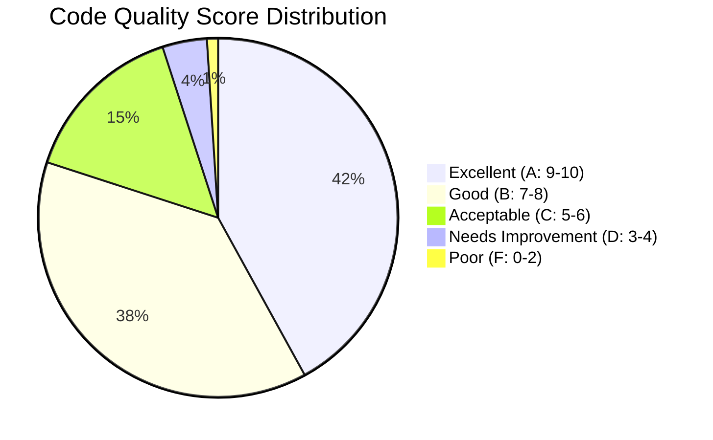

### Module Quality Breakdown

| Module | Lines of Code | Quality Score | Rating | Maintainability | Status |
|--------|--------------|---------------|--------|----------------|---------|
| Core Engine | 4,520 | 9.1 | A | High | 🟢 Excellent |
| API Layer | 3,180 | 8.5 | A | High | 🟢 Excellent |
| Security Module | 1,450 | 9.3 | A | High | 🟢 Excellent |
| Database Layer | 2,840 | 8.2 | B | Medium-High | 🟢 Good |
| UI Components | 3,950 | 7.8 | B | Medium | 🟢 Good |
| Integration Layer | 2,120 | 6.8 | C | Medium | 🟡 Acceptable |
| Legacy Module | 1,890 | 5.2 | C | Low | 🔴 Needs Refactoring |
| **Average** | **19,950** | **8.2** | **B+** | **Medium-High** | **🟢 Good** |

---

## Code Complexity Analysis

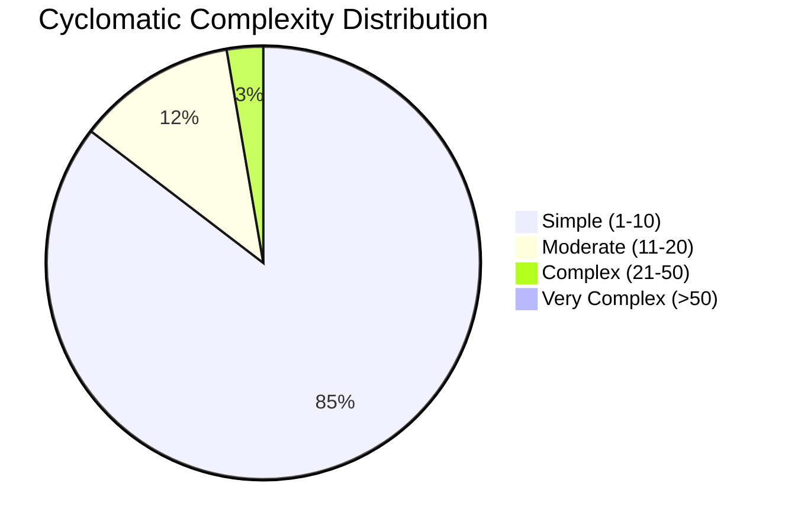

### Complexity Metrics

| Complexity Level | Function Count | % of Total | Target | Status |
|-----------------|---------------|------------|--------|---------|
| Simple (1-10) | 2,456 | 85.0% | > 70% | 🟢 Excellent |
| Moderate (11-20) | 342 | 11.8% | < 20% | 🟢 Good |
| Complex (21-50) | 78 | 2.7% | < 8% | 🟢 Good |
| Very Complex (>50) | 12 | 0.4% | < 2% | 🟢 Good |
| **Total Functions** | **2,888** | **100%** | - | **🟢 Well Managed** |

### High Complexity Functions Requiring Attention

| Function | Module | Complexity | Lines | Priority | Action |
|----------|--------|------------|-------|----------|---------|
| processDataBatch() | DataProcessor | 68 | 245 | High | 🔴 Refactor |
| validateUserInput() | InputHandler | 58 | 189 | High | 🔴 Refactor |
| generateReport() | ReportEngine | 52 | 312 | Medium | 🟡 Review |

---

## Code Issues & Technical Debt

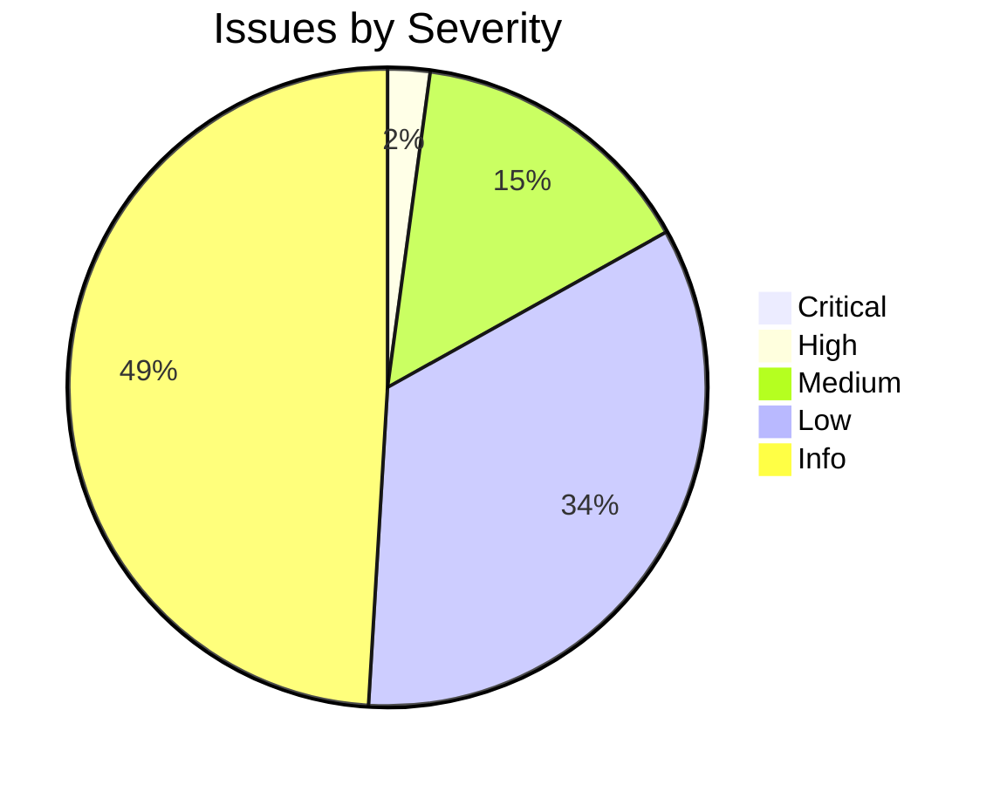

### Issue Breakdown

| Severity | Count | % of Total | SLA | Age (Avg) | Status |
|----------|-------|------------|-----|-----------|---------|
| 🔴 Critical | 2 | 0.2% | 24h | 8 days | 🔴 Overdue |
| 🟠 High | 18 | 2.1% | 7 days | 12 days | 🟡 Monitor |
| 🟡 Medium | 124 | 14.7% | 30 days | 18 days | 🟢 On Track |
| 🔵 Low | 286 | 33.9% | 90 days | 35 days | 🟢 Normal |
| ℹ️ Info | 412 | 48.9% | - | 42 days | 🟢 Normal |
| **Total** | **842** | **100%** | - | **28 days** | **🟡 Acceptable** |

---

## Technical Debt

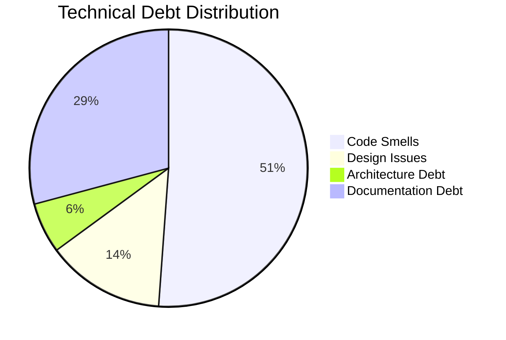

### Technical Debt Metrics

| Category | Count | Effort (days) | Priority | Trend |
|----------|-------|---------------|----------|-------|
| Code Smells | 156 | 12.5 | Medium | ↓ |
| Design Issues | 42 | 8.2 | High | → |
| Architecture Debt | 18 | 15.0 | Critical | ↑ |
| Documentation Debt | 89 | 6.8 | Low | ↓ |
| Test Debt | 34 | 4.2 | Medium | ↓ |
| **Total** | **339** | **46.7** | - | **→** |

**Technical Debt Ratio:** 3.8% (Total Debt / Development Cost)  
**Target:** < 5.0%  
**Status:** 🟢 Within acceptable limits

---

## Code Duplication Analysis

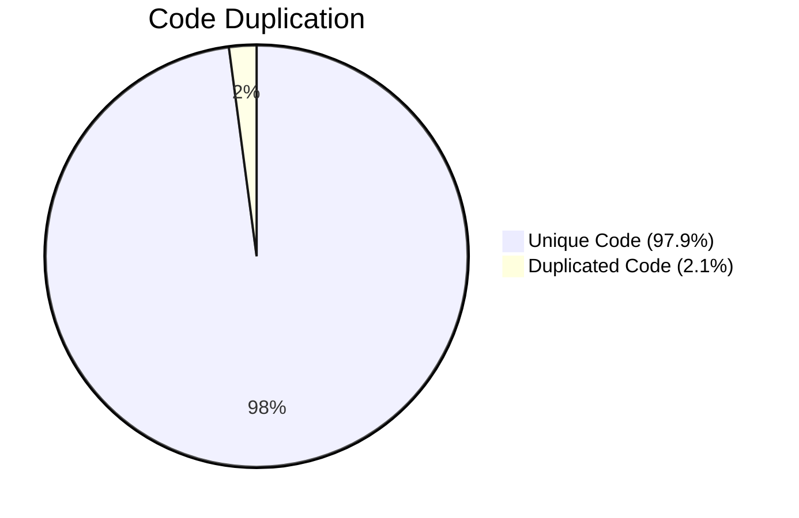

### Duplication Metrics

| Metric | Value | Target | Status |
|--------|-------|--------|---------|
| Duplicated Lines | 418 | < 1,000 | 🟢 Good |
| Duplicated Blocks | 34 | < 50 | 🟢 Good |
| Duplication % | 2.1% | < 5% | 🟢 Excellent |
| Files with Duplication | 12 | < 20 | 🟢 Good |

### Files with Highest Duplication

| File | Duplicated Lines | Duplication % | Priority |
|------|-----------------|---------------|----------|
| UserController.java | 89 | 18.2% | 🔴 High |
| DataValidator.py | 67 | 12.4% | 🟡 Medium |
| ReportGenerator.js | 45 | 8.9% | 🟡 Medium |

---

## Code Style & Standards Compliance

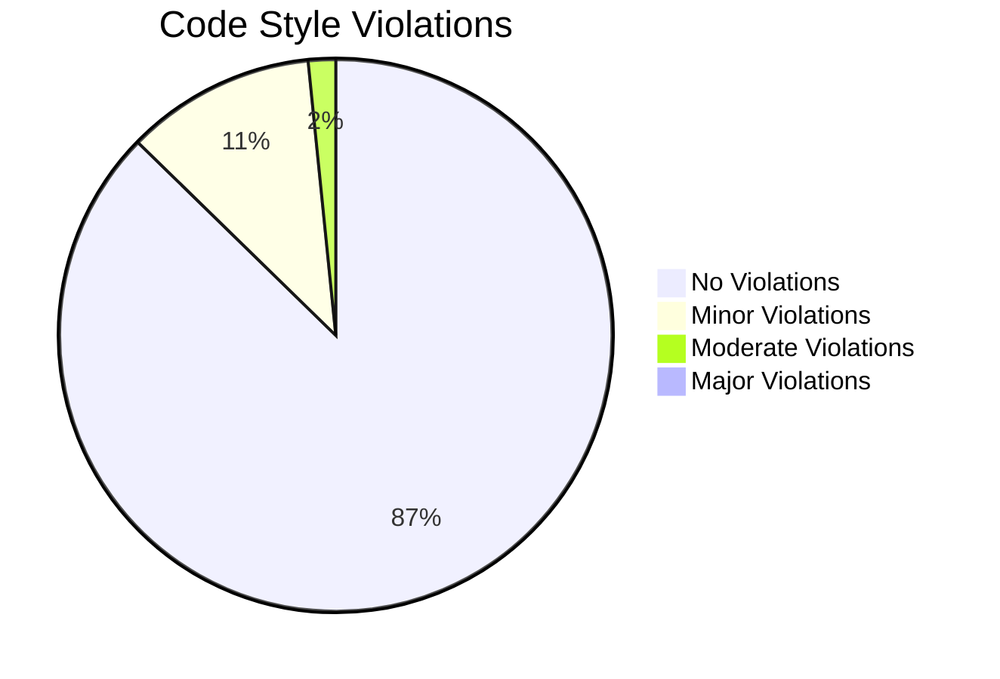

### Style Compliance

| Violation Type | Count | Severity | Status |
|---------------|-------|----------|---------|
| Naming Conventions | 156 | Low | 🟢 Acceptable |
| Formatting Issues | 89 | Info | 🟢 Acceptable |
| Documentation Missing | 67 | Medium | 🟡 Monitor |
| Unused Imports | 124 | Low | 🟢 Minor |
| Magic Numbers | 34 | Medium | 🟡 Review |
| Long Methods | 12 | High | 🔴 Refactor |
| **Total** | **482** | - | **🟡 Acceptable** |

**Overall Compliance Rate:** 94.8%  
**Target:** > 90%  
**Status:** 🟢 Exceeds target

---

## Security Analysis

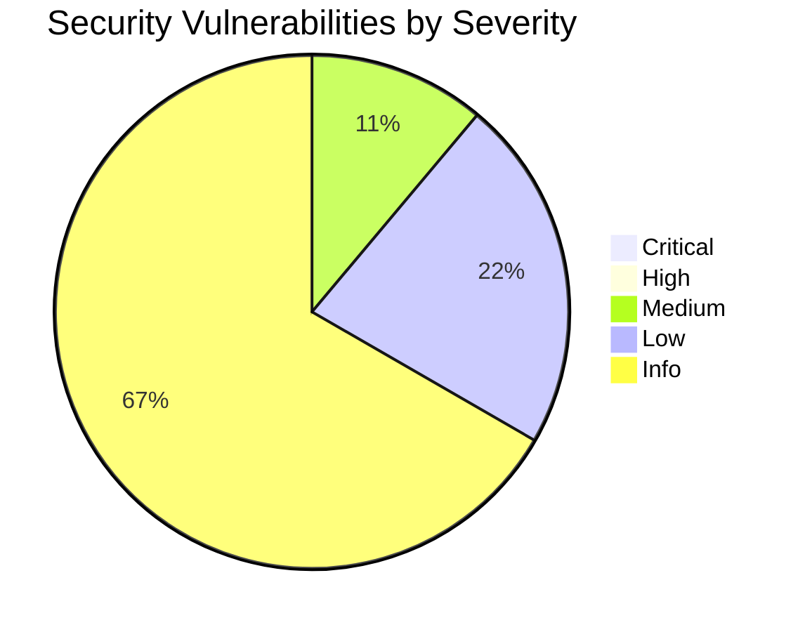

### Security Findings

| Severity | Count | Category | Status | Age |
|----------|-------|----------|---------|-----|
| Critical | 0 | - | - | - |
| High | 0 | - | - | - |
| Medium | 2 | Input Validation | 🟡 In Progress | 5 days |
| Low | 4 | Configuration | 🟢 Scheduled | 14 days |
| Info | 12 | Best Practices | 🟢 Backlog | 28 days |

**Security Score:** 9.2/10  
**Target:** > 8.0  
**Status:** 🟢 Excellent

### Security Recommendations

1. Implement input sanitization in 2 endpoints (Medium priority)
2. Update security headers configuration (Low priority)
3. Review third-party dependency versions (Info)

---

## Code Maintainability Index

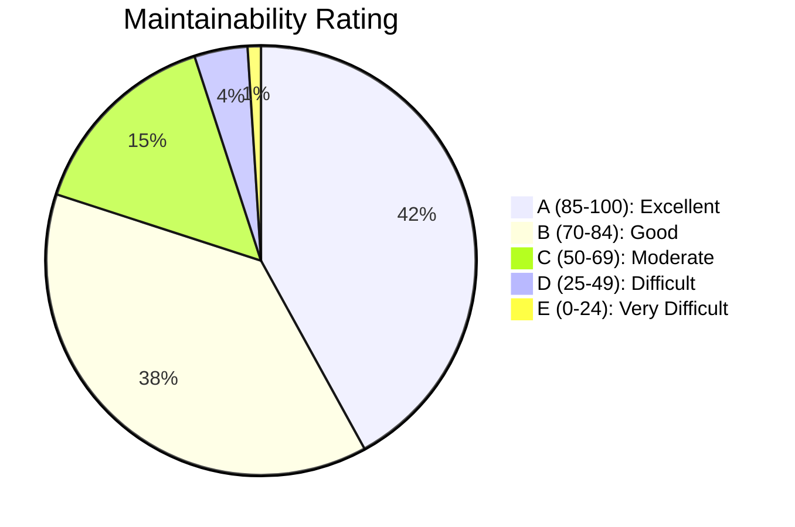

### Maintainability Breakdown

| Rating | Module Count | % of Total | Avg. MI Score | Action Required |
|--------|-------------|------------|---------------|-----------------|
| A (85-100) | 42 | 42% | 91.2 | None 🟢 |
| B (70-84) | 38 | 38% | 76.5 | Monitor 🟢 |
| C (50-69) | 15 | 15% | 58.3 | Plan Refactoring 🟡 |
| D (25-49) | 4 | 4% | 38.7 | Refactor Soon 🔴 |
| E (0-24) | 1 | 1% | 18.2 | Critical Refactoring 🔴 |

**Average Maintainability Index:** 78.6  
**Target:** > 70  
**Status:** 🟢 Good

---

## Code Review Metrics

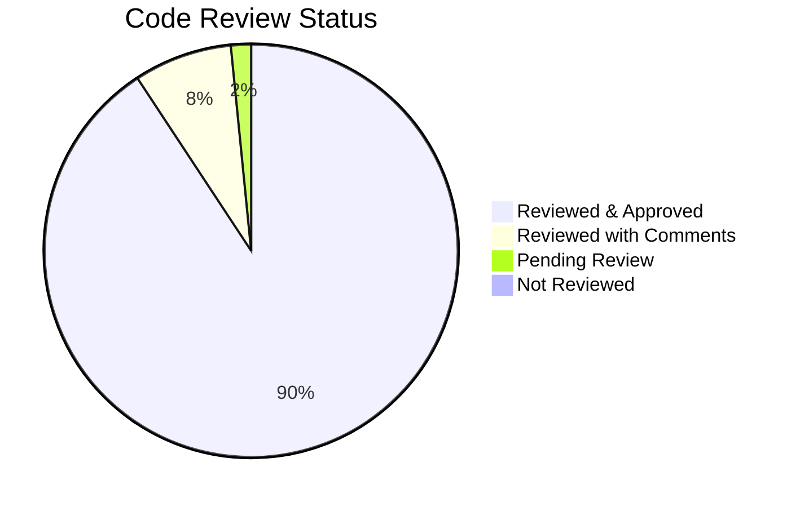

### Review Statistics

| Metric | Value | Target | Status |
|--------|-------|--------|---------|
| Review Coverage | 98.3% | > 95% | 🟢 Excellent |
| Avg. Review Time | 4.2 hours | < 8 hours | 🟢 Good |
| Comments per Review | 6.5 | 4-10 | 🟢 Optimal |
| Review Approval Rate | 92.2% | > 85% | 🟢 Good |
| Reviews per Week | 47 | - | - |

### Review Quality Metrics

| Metric | Value | Trend |
|--------|-------|-------|
| Defects Found in Review | 124 | ↑ Good |
| Avg. Commits per PR | 3.2 | ↓ Better |
| Avg. Files Changed per PR | 4.8 | → Stable |
| Rework Rate | 8.3% | ↓ Improving |

---

## Documentation Coverage

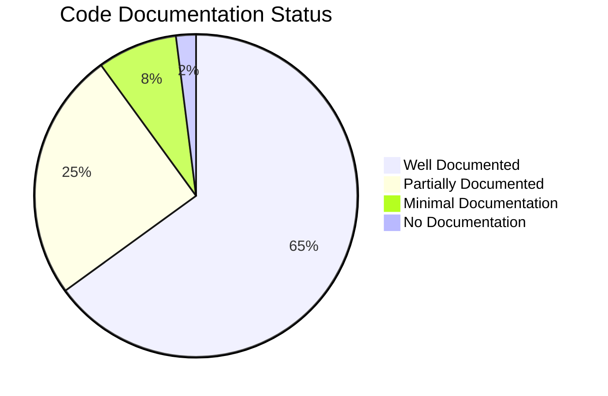

### Documentation Metrics

| Type | Coverage % | Target | Status |
|------|-----------|--------|---------|
| Public API Documentation | 92.5% | > 90% | 🟢 Good |
| Function/Method Comments | 78.3% | > 75% | 🟢 Good |
| Class Documentation | 85.2% | > 80% | 🟢 Good |
| Inline Comments | 42.1% | > 30% | 🟢 Good |
| README Files | 95.0% | 100% | 🟡 Almost |
| Architecture Documentation | 88.0% | > 85% | 🟢 Good |

---

## Dependency Analysis

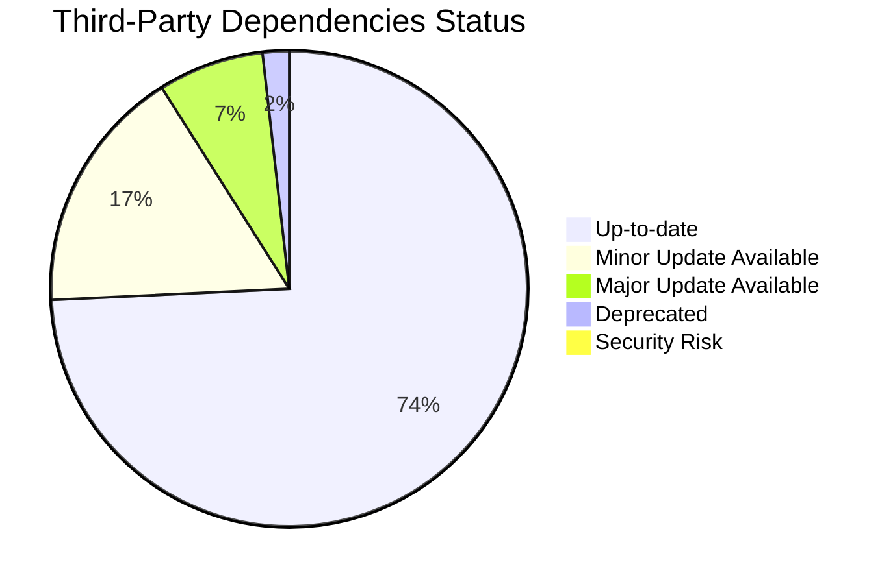

### Dependency Health

| Status | Count | Action Required | Priority |
|--------|-------|----------------|----------|
| Up-to-date | 124 | None | - |
| Minor Updates Available | 28 | Optional | 🟢 Low |
| Major Updates Available | 12 | Plan Upgrade | 🟡 Medium |
| Deprecated | 3 | Replace | 🔴 High |
| Security Risk | 1 | Immediate Update | 🔴 Critical |

**Total Dependencies:** 168  
**Outdated Dependencies:** 26.2%  
**Security Score:** 8.8/10

---

## Code Churn & Stability

| Metric | Value | Trend | Status |
|--------|-------|-------|---------|
| Files Changed (Last Week) | 156 | ↓ | 🟢 Stable |
| Churn Rate | 12.3% | ↓ | 🟢 Decreasing |
| Hotspot Files (>10 changes) | 8 | → | 🟡 Monitor |
| Avg. Commits per Day | 23 | ↑ | 🟢 Active |
| Refactoring Rate | 15.2% | ↑ | 🟢 Improving |

### Top Changed Files (Hotspots)

| File | Changes (30d) | Complexity | Authors | Status |
|------|--------------|------------|---------|---------|
| UserService.java | 34 | High | 5 | 🔴 High Churn |
| PaymentController.java | 28 | Medium | 3 | 🟡 Monitor |
| DataProcessor.py | 24 | High | 4 | 🔴 Refactor Needed |

---

## Performance & Optimization

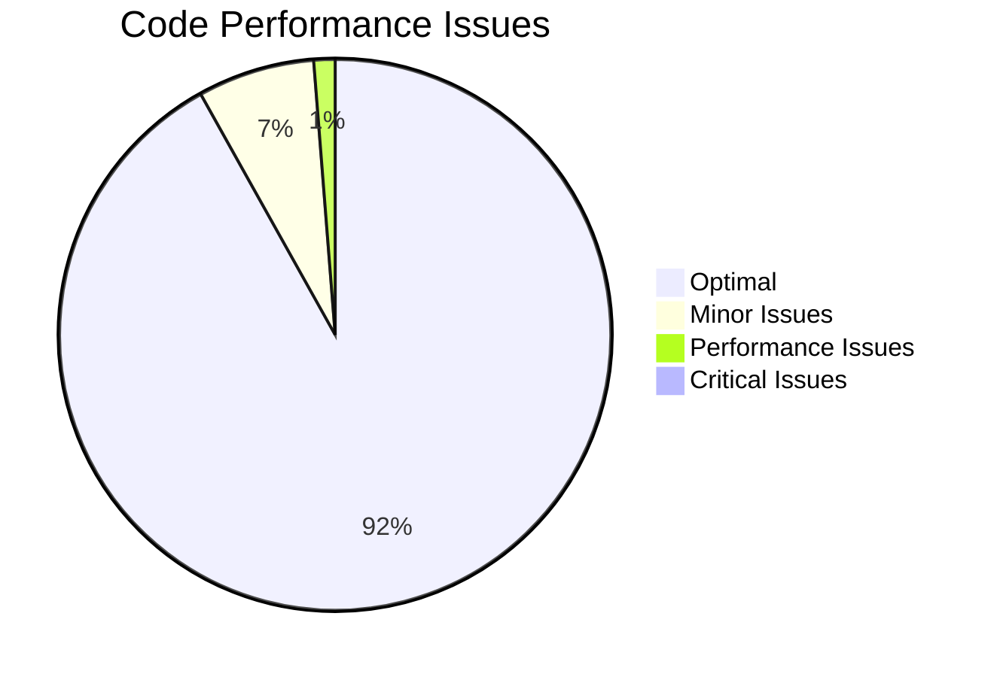

### Performance Metrics

| Category | Count | Avg. Impact | Priority |
|----------|-------|-------------|----------|
| Inefficient Algorithms | 12 | Medium | 🟡 Optimize |
| Memory Leaks | 0 | - | 🟢 None |
| Unnecessary Computations | 18 | Low | 🟢 Minor |
| Database Query Issues | 6 | High | 🔴 Fix |
| **Total Performance Issues** | **36** | **Low** | **🟡 Acceptable** |

---

## Build & Integration Quality

| Metric | Value | Target | Status |
|--------|-------|--------|---------|
| Build Success Rate | 97.8% | > 95% | 🟢 Excellent |
| Avg. Build Time | 8.5 min | < 10 min | 🟢 Good |
| Build Failures (Last 30d) | 7 | < 10 | 🟢 Good |
| CI Pipeline Pass Rate | 94.2% | > 90% | 🟢 Good |
| Deployment Frequency | 3.2/week | > 2/week | 🟢 Good |
| Mean Time to Recovery | 1.2 hours | < 4 hours | 🟢 Excellent |

---

## Code Quality Trends (Last 30 Days)

| Metric | Previous | Current | Change | Trend |
|--------|----------|---------|--------|-------|
| Quality Score | 7.9 | 8.2 | +0.3 | ↑ 🟢 |
| Technical Debt Ratio | 4.2% | 3.8% | -0.4% | ↓ 🟢 |
| Code Coverage | 84.1% | 87.2% | +3.1% | ↑ 🟢 |
| Security Score | 8.9 | 9.2 | +0.3 | ↑ 🟢 |
| Duplication | 2.8% | 2.1% | -0.7% | ↓ 🟢 |
| Critical Issues | 5 | 2 | -3 | ↓ 🟢 |

---

## Top Code Quality Issues

| Issue ID | Description | Severity | Module | Age (days) | Owner | Status |
|----------|-------------|----------|--------|-----------|-------|---------|
| CQ-001 | Null pointer risk in data processor | Critical | Core | 8 | Dev1 | 🔴 In Progress |
| CQ-002 | SQL injection vulnerability | Critical | API | 5 | Dev2 | 🔴 In Progress |
| CQ-003 | High cyclomatic complexity in validation | High | Security | 12 | Dev3 | 🟡 Planned |
| CQ-004 | Memory leak in cache manager | High | Utils | 15 | Dev4 | 🟡 Investigating |
| CQ-005 | Deprecated API usage | High | Integration | 20 | Dev5 | 🟡 Backlog |

---

## Best Practices Compliance

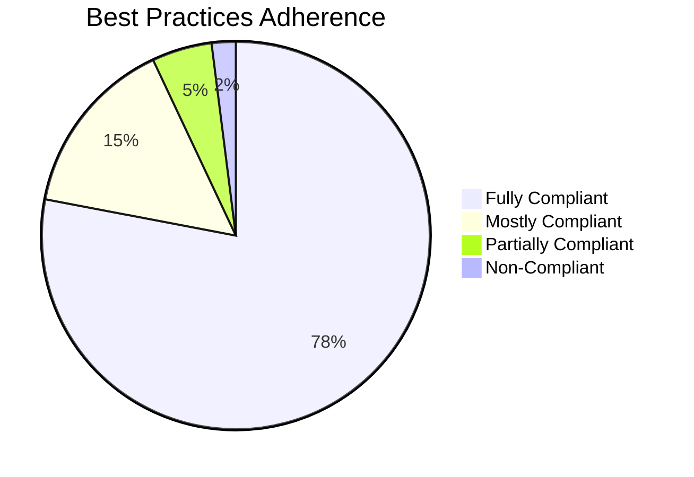

### Compliance Checklist

| Practice | Status | Compliance % | Action |
|----------|--------|--------------|--------|
| SOLID Principles | ✅ | 92% | Maintain |
| DRY (Don't Repeat Yourself) | ✅ | 97.9% | Excellent |
| Error Handling | ✅ | 89% | Good |
| Logging Standards | ✅ | 85% | Good |
| Security Best Practices | ✅ | 94% | Excellent |
| Testing Standards | ✅ | 91% | Excellent |
| Code Review Process | ✅ | 98% | Excellent |
| Documentation Standards | ⚠️ | 78% | Improve |
| Performance Guidelines | ⚠️ | 82% | Monitor |
| Accessibility Standards | ❌ | 45% | Priority Fix |

---

## Recommended Actions

### Immediate (This Sprint)

1. **Fix 2 Critical Issues** - CQ-001, CQ-002
   - Owner: Development Team
   - Due: End of Sprint

2. **Refactor High Complexity Functions** - 3 functions with complexity > 50
   - Owner: Tech Lead
   - Due: Next 2 weeks

3. **Update Deprecated Dependency** - Security risk identified
   - Owner: DevOps
   - Due: This week

### Short-Term (Next Month)

4. **Reduce Code Duplication** in UserController and DataValidator
5. **Improve Documentation Coverage** to > 85%
6. **Address Architecture Debt** - 18 items identified

### Long-Term (Next Quarter)

7. **Refactor Legacy Module** - Currently rated 5.2/10
8. **Implement Accessibility Standards** - Currently 45% compliant
9. **Optimize Build Pipeline** - Target < 7 min build time

---

**Legend:**
- 🟢 Green: Excellent or within targets
- 🟡 Yellow: Good or needs monitoring
- 🔴 Red: Requires immediate attention
- ↑ Improving trend
- ↓ Declining/Improving (context dependent)
- → Stable trend

---

**Report Generated:** [Auto-generated timestamp]  
**Next Update:** [Date]  
**Data Sources:** SonarQube, ESLint, Security Scanner, Code Review Tool, Build System
