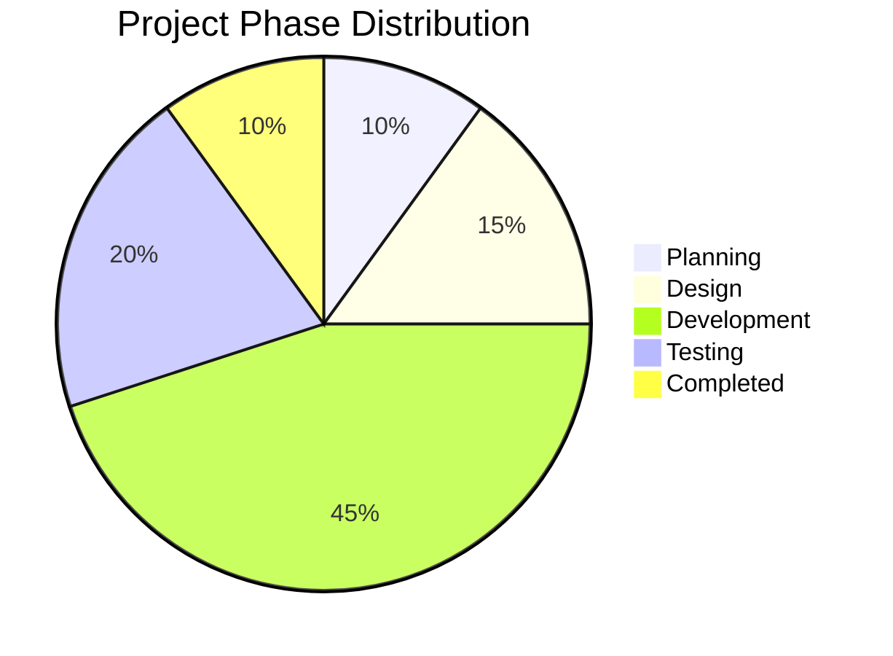
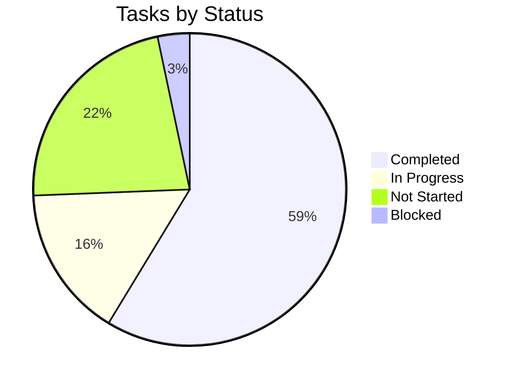
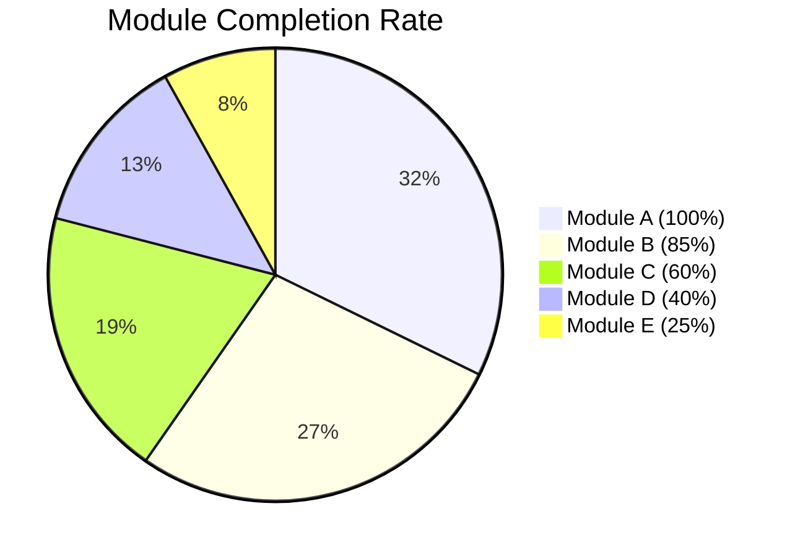
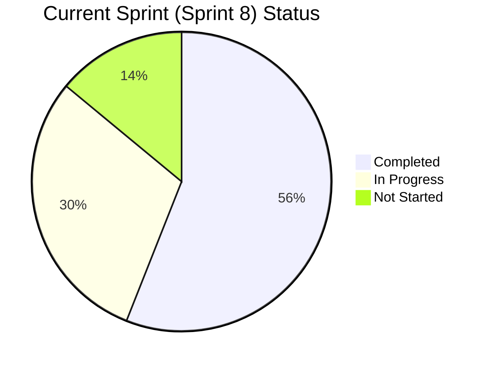
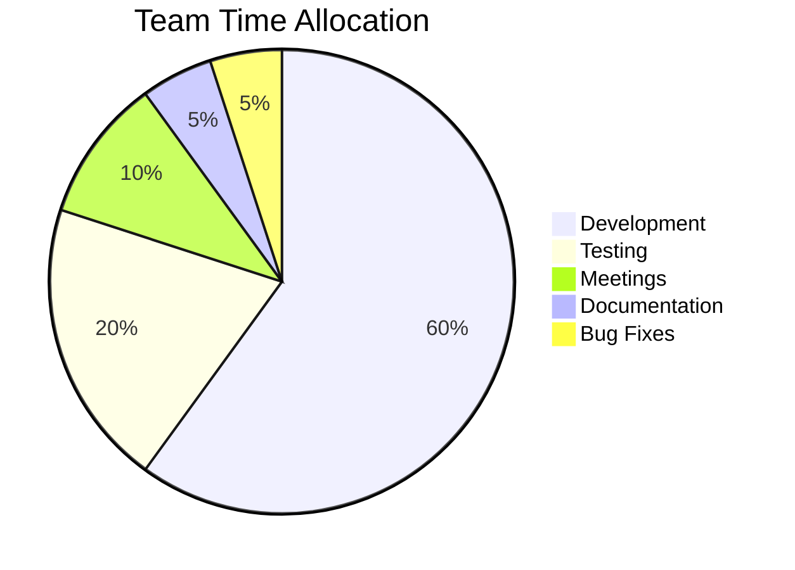
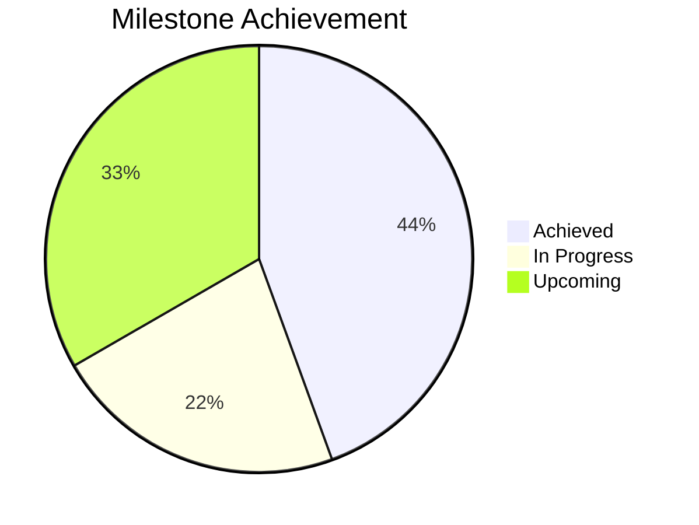
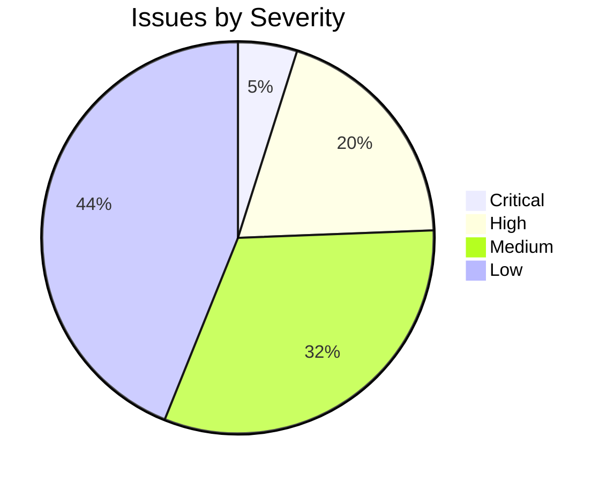
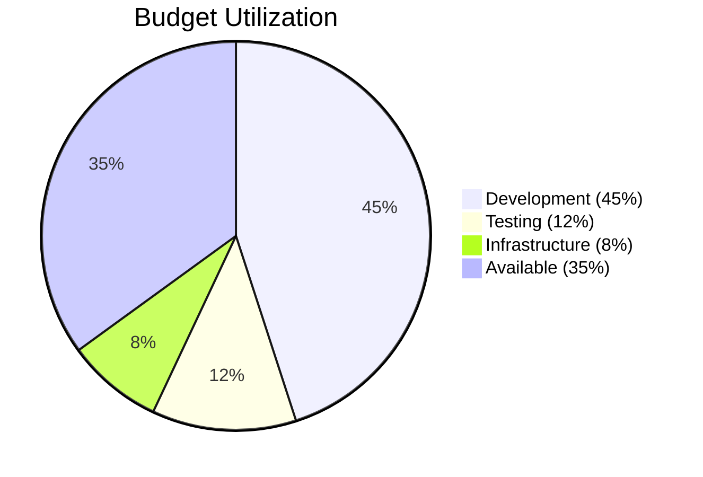

# Project Progress Dashboard

**Project:** Network Intrusion Detection System  

_Last updated: {{ git_revision_date_localized }}_

---

!!! danger "⚠️ TEMPLATE - DO NOT USE AS-IS"
    **This is a template file.** Copy and customize for your own use. The content below is placeholder text only and should not be considered as actual documentation

## Executive Summary

| Metric | Value | Status |
|--------|-------|--------|
| Overall Progress | 65% | 🟡 On Track |
| Schedule Variance | +2 days | 🟢 Ahead |
| Budget Utilization | 58% | 🟢 On Budget |
| Team Velocity | 42 story points/sprint | 🟢 Good |
| Open Issues | 23 | 🟡 Monitor |
| Blocked Items | 2 | 🔴 Attention Needed |

---

## Overall Project Status

---

## Task Completion Status

### Task Breakdown by Status

| Status | Count | Percentage |
|--------|-------|------------|
| ✅ Completed | 142 | 58.7% |
| 🔄 In Progress | 38 | 15.7% |
| 📋 Not Started | 54 | 22.3% |
| 🚫 Blocked | 8 | 3.3% |
| **Total** | **242** | **100%** |

---

## Progress by Module/Component

### Detailed Module Status

| Module/Component | Total Tasks | Completed | In Progress | Not Started | Completion % | Status |
|-----------------|-------------|-----------|-------------|-------------|--------------|---------|
| Module A - Core Engine | 45 | 45 | 0 | 0 | 100% | 🟢 Done |
| Module B - API Layer | 35 | 30 | 3 | 2 | 85% | 🟢 Good |
| Module C - User Interface | 50 | 30 | 12 | 8 | 60% | 🟡 On Track |
| Module D - Database | 40 | 16 | 15 | 9 | 40% | 🟡 Behind |
| Module E - Integration | 32 | 8 | 10 | 14 | 25% | 🔴 At Risk |

---

## Sprint Progress

### Sprint Metrics

| Metric | Planned | Actual | Variance |
|--------|---------|--------|----------|
| Story Points Committed | 50 | 50 | 0 |
| Story Points Completed | - | 42 | -8 |
| Tasks Committed | 50 | 50 | 0 |
| Tasks Completed | - | 28 | -22 |
| Sprint Velocity | - | 84% | -16% |

---

## Team Capacity & Utilization

### Resource Allocation

| Resource/Team Member | Allocated Tasks | Completed | In Progress | Utilization % |
|---------------------|-----------------|-----------|-------------|---------------|
| Developer 1 | 12 | 8 | 4 | 95% |
| Developer 2 | 10 | 7 | 3 | 90% |
| Developer 3 | 11 | 9 | 2 | 85% |
| Tester 1 | 8 | 5 | 3 | 100% |
| Tester 2 | 7 | 6 | 1 | 88% |

---

## Milestone Status

### Milestone Tracker

| Milestone | Target Date | Actual/Forecast Date | Status | Progress |
|-----------|-------------|---------------------|---------|----------|
| M1: Requirements Complete | 2024-01-15 | 2024-01-15 | ✅ Complete | 100% |
| M2: Design Complete | 2024-02-28 | 2024-02-26 | ✅ Complete | 100% |
| M3: Development Phase 1 | 2024-04-15 | 2024-04-15 | ✅ Complete | 100% |
| M4: Development Phase 2 | 2024-06-30 | 2024-06-28 | ✅ Complete | 100% |
| M5: Integration Complete | 2024-08-15 | 2024-08-20 | 🔄 In Progress | 75% |
| M6: Testing Complete | 2024-09-30 | 2024-10-05 | 🔄 In Progress | 40% |
| M7: Documentation Complete | 2024-10-15 | 2024-10-20 | 📋 Upcoming | 0% |
| M8: Release Candidate | 2024-10-31 | 2024-11-05 | 📋 Upcoming | 0% |
| M9: Production Release | 2024-11-15 | 2024-11-20 | 📋 Upcoming | 0% |

---

## Risk & Issue Summary

### Top 5 Risks

| Risk ID | Description | Probability | Impact | Mitigation Status |
|---------|-------------|-------------|--------|-------------------|
| R-001 | Resource availability for Q4 | High | High | 🟡 In Progress |
| R-002 | Third-party API dependency | Medium | High | 🟢 Mitigated |
| R-003 | Performance requirements | Medium | Medium | 🔄 Monitoring |
| R-004 | Integration complexity | Low | High | 🟡 Planning |
| R-005 | Security audit timeline | Low | Medium | 🟢 Controlled |

---

## Budget Status

### Budget Breakdown

| Category | Budgeted | Spent | Remaining | % Used |
|----------|----------|-------|-----------|---------|
| Development | $500,000 | $450,000 | $50,000 | 90% |
| Testing | $150,000 | $120,000 | $30,000 | 80% |
| Infrastructure | $100,000 | $80,000 | $20,000 | 80% |
| Documentation | $50,000 | $30,000 | $20,000 | 60% |
| Contingency | $200,000 | $15,000 | $185,000 | 7.5% |
| **Total** | **$1,000,000** | **$695,000** | **$305,000** | **69.5%** |

---

## Key Performance Indicators (KPIs)

| KPI | Target | Actual | Status |
|-----|--------|--------|---------|
| On-Time Delivery Rate | 95% | 92% | 🟡 Close |
| Defect Density | < 0.5/KLOC | 0.4/KLOC | 🟢 Good |
| Code Review Coverage | 100% | 98% | 🟢 Good |
| Test Coverage | > 80% | 85% | 🟢 Exceeds |
| Customer Satisfaction | > 4.0/5.0 | 4.2/5.0 | 🟢 Exceeds |
| Team Productivity | Baseline | +12% | 🟢 Excellent |

---

## Action Items & Next Steps

### High Priority Actions

1. **[Action 1]** - Resolve blocked tasks in Module E - Owner: [Name] - Due: [Date]
2. **[Action 2]** - Address resource constraints for Q4 - Owner: [Name] - Due: [Date]
3. **[Action 3]** - Complete security review - Owner: [Name] - Due: [Date]

### Upcoming Focus Areas

- [ ] Complete Module E integration
- [ ] Begin qualification testing
- [ ] Finalize user documentation
- [ ] Prepare for release candidate build

---

**Legend:**
- 🟢 Green: On track, no issues
- 🟡 Yellow: Minor concerns, monitoring required
- 🔴 Red: Significant issues, immediate attention needed
- ✅ Complete
- 🔄 In Progress
- 📋 Not Started
- 🚫 Blocked

---

**Report Generated:** [Auto-generated timestamp]  
**Next Update:** [Date]
