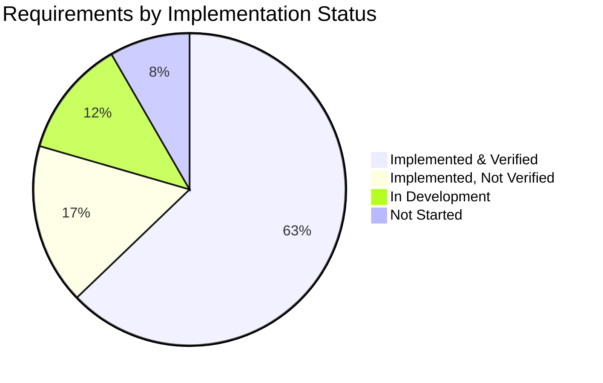
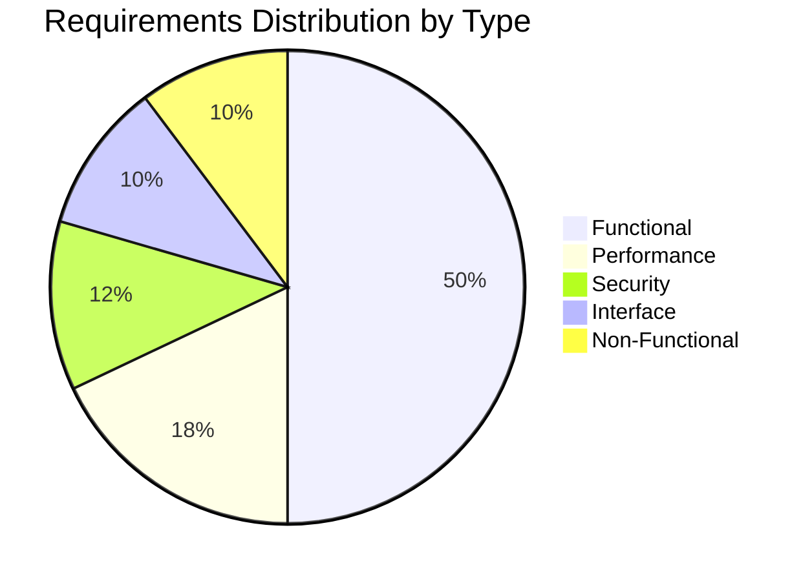
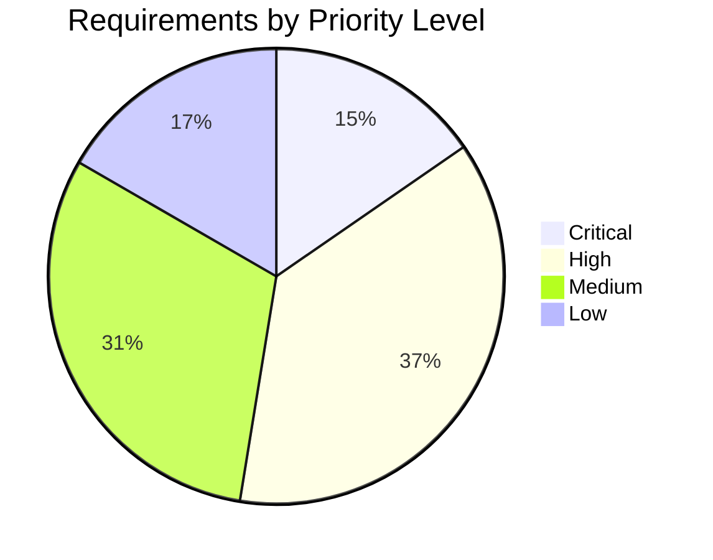
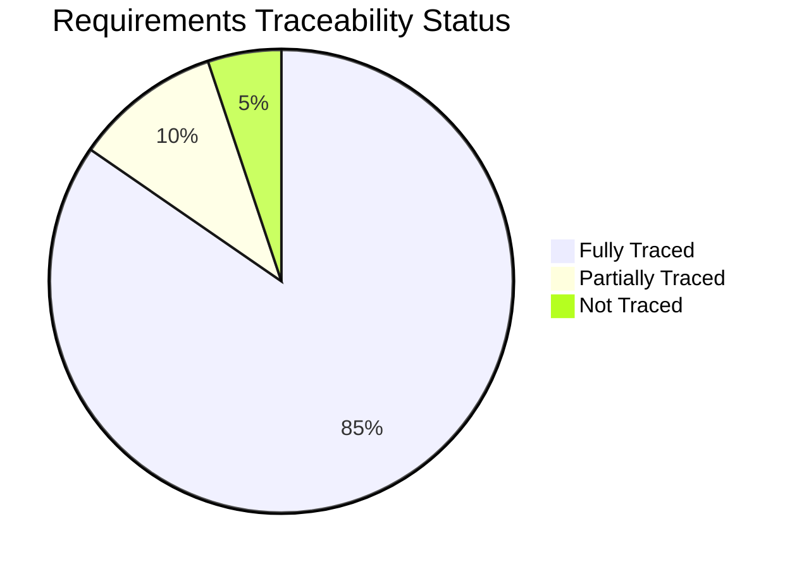
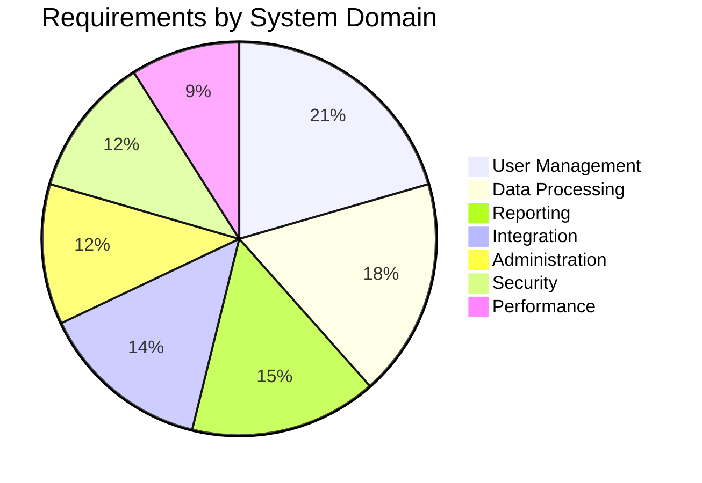
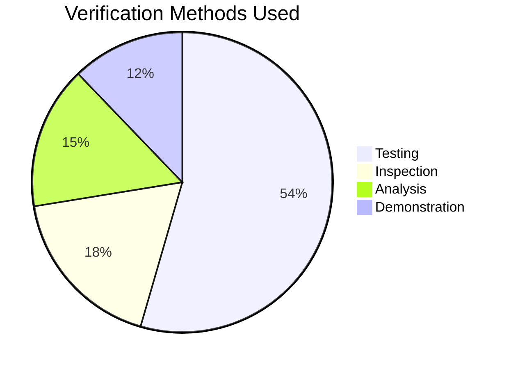
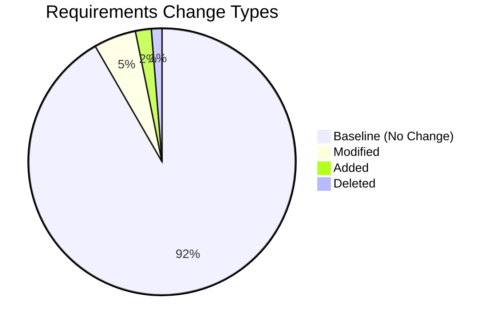
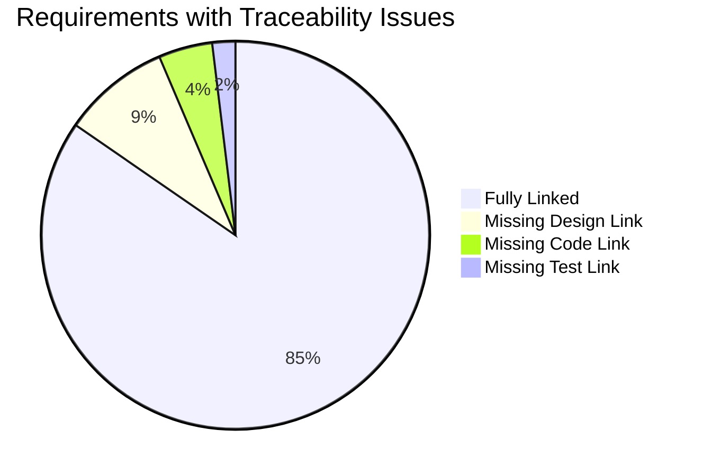
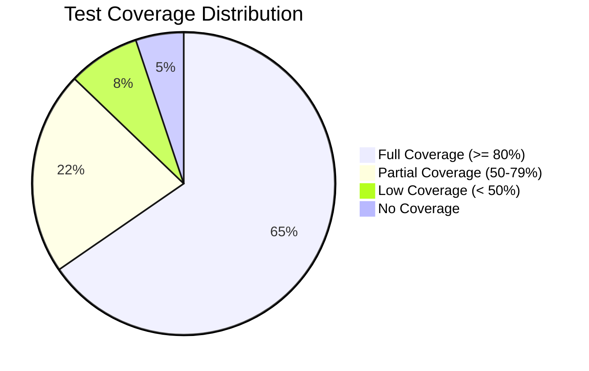
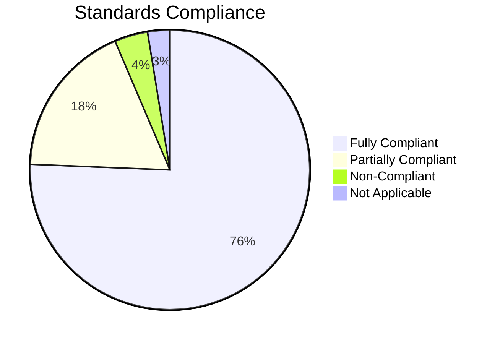

# Requirements Traceability Dashboard

**Project:** Network Intrusion Detection System  

_Last updated: {{ git_revision_date_localized }}_

---

!!! danger "⚠️ TEMPLATE - DO NOT USE AS-IS"
    **This is a template file.** Copy and customize for your own use. The content below is placeholder text only and should not be considered as actual documentation

## Executive Summary

| Metric | Value | Status |
|--------|-------|--------|
| Total Requirements | 156 | - |
| Requirements Implemented | 124 | 🟢 79.5% |
| Requirements Verified | 98 | 🟡 62.8% |
| Orphaned Requirements | 3 | 🔴 Action Needed |
| Traceability Coverage | 95.1% | 🟢 Good |
| Requirements Volatility | 8.3% | 🟢 Stable |

---

## Requirements Status Overview

### Requirements Breakdown

| Status | Count | Percentage |
|--------|-------|------------|
| ✅ Implemented & Verified | 98 | 62.8% |
| 🔧 Implemented, Not Verified | 26 | 16.7% |
| 🔄 In Development | 19 | 12.2% |
| 📋 Not Started | 13 | 8.3% |
| **Total** | **156** | **100%** |

---

## Requirements by Type

### Requirements Type Breakdown

| Type | Total | Implemented | Verified | Not Started | Coverage % |
|------|-------|-------------|----------|-------------|------------|
| Functional | 78 | 65 | 52 | 6 | 83.3% |
| Performance | 28 | 22 | 18 | 3 | 78.6% |
| Security | 18 | 15 | 12 | 2 | 83.3% |
| Interface | 16 | 12 | 8 | 1 | 75.0% |
| Non-Functional | 16 | 10 | 8 | 1 | 62.5% |
| **Total** | **156** | **124** | **98** | **13** | **79.5%** |

---

## Requirements by Priority

### Priority-Based Status

| Priority | Total | Implemented | Verified | Pending | Verification Rate |
|----------|-------|-------------|----------|---------|-------------------|
| Critical | 24 | 24 | 22 | 0 | 91.7% 🟢 |
| High | 58 | 54 | 42 | 4 | 72.4% 🟡 |
| Medium | 48 | 32 | 24 | 9 | 50.0% 🟡 |
| Low | 26 | 14 | 10 | 7 | 38.5% 🔴 |
| **Total** | **156** | **124** | **98** | **20** | **62.8%** |

---

## Traceability Matrix Summary

### Traceability Coverage

| Traceability Link | Total Req. | Traced | Not Traced | Coverage % |
|------------------|------------|---------|------------|------------|
| Requirements → Design | 156 | 142 | 14 | 91.0% 🟢 |
| Requirements → Code | 156 | 138 | 18 | 88.5% 🟢 |
| Requirements → Tests | 156 | 135 | 21 | 86.5% 🟢 |
| Requirements → Verification | 156 | 98 | 58 | 62.8% 🟡 |
| **Average Coverage** | - | - | - | **82.2%** 🟢 |

---

## Requirements by Phase/Domain

### Domain-Based Status

| Domain | Total Req. | Implemented | Verified | Completion % | Status |
|--------|-----------|-------------|----------|--------------|---------|
| User Management | 32 | 30 | 26 | 81.3% | 🟢 Good |
| Data Processing | 28 | 24 | 20 | 71.4% | 🟡 On Track |
| Reporting | 24 | 20 | 16 | 66.7% | 🟡 On Track |
| Integration | 22 | 18 | 12 | 54.5% | 🟡 Behind |
| Administration | 18 | 16 | 12 | 66.7% | 🟡 On Track |
| Security | 18 | 16 | 12 | 66.7% | 🟡 On Track |
| Performance | 14 | 0 | 0 | 0% | 🔴 Not Started |

---

## Requirements Verification Status

### Verification Method Breakdown

| Verification Method | Requirements Count | Verified | Pending | Success Rate |
|-------------------|-------------------|----------|---------|--------------|
| Testing | 85 | 68 | 17 | 80.0% 🟢 |
| Inspection | 28 | 22 | 6 | 78.6% 🟢 |
| Analysis | 24 | 18 | 6 | 75.0% 🟡 |
| Demonstration | 19 | 14 | 5 | 73.7% 🟡 |
| **Total** | **156** | **122** | **34** | **78.2%** |

---

## Requirements Changes & Volatility

### Change History

| Change Type | Count | % of Total | Impact |
|-------------|-------|------------|---------|
| No Change (Baseline) | 143 | 91.7% | - |
| Modified | 8 | 5.1% | Low 🟢 |
| Added | 3 | 1.9% | Low 🟢 |
| Deleted | 2 | 1.3% | Low 🟢 |
| **Volatility Rate** | - | **8.3%** | **Stable 🟢** |

---

## Orphaned & Missing Links

### Issues Requiring Attention

| Issue Type | Count | Requirements IDs | Priority |
|-----------|-------|------------------|----------|
| No Design Trace | 14 | REQ-045, REQ-078, REQ-089... | 🔴 High |
| No Code Trace | 7 | REQ-112, REQ-134... | 🔴 High |
| No Test Trace | 3 | REQ-145, REQ-151, REQ-156 | 🟡 Medium |
| Orphaned (No Links) | 3 | REQ-023, REQ-067, REQ-091 | 🔴 Critical |

---

## Requirements Coverage by Feature

| Feature | Total Req. | Design | Code | Test | Verified | Coverage % |
|---------|-----------|--------|------|------|----------|------------|
| Feature A - Login System | 18 | 18 | 18 | 18 | 16 | 88.9% 🟢 |
| Feature B - Dashboard | 22 | 22 | 20 | 19 | 15 | 68.2% 🟡 |
| Feature C - Data Import | 15 | 15 | 15 | 14 | 12 | 80.0% 🟢 |
| Feature D - Reporting | 24 | 22 | 20 | 18 | 14 | 58.3% 🟡 |
| Feature E - API | 16 | 16 | 14 | 12 | 9 | 56.3% 🟡 |
| Feature F - Admin Panel | 20 | 18 | 16 | 14 | 11 | 55.0% 🟡 |
| Feature G - Analytics | 12 | 10 | 8 | 6 | 4 | 33.3% 🔴 |
| Feature H - Integration | 14 | 12 | 10 | 8 | 5 | 35.7% 🔴 |
| Feature I - Settings | 15 | 15 | 14 | 13 | 12 | 80.0% 🟢 |

---

## Test Coverage per Requirement Type

### Test Coverage Analysis

| Coverage Level | Count | Percentage | Status |
|---------------|-------|------------|---------|
| Full Coverage (≥ 80%) | 102 | 65.4% | 🟢 Good |
| Partial Coverage (50-79%) | 34 | 21.8% | 🟡 Acceptable |
| Low Coverage (< 50%) | 12 | 7.7% | 🔴 Poor |
| No Coverage (0%) | 8 | 5.1% | 🔴 Critical |
| **Average Coverage** | - | **75.3%** | **🟡 On Track** |

---

## Requirements Age & Implementation Timeline

| Age (Weeks) | Count | Status | Action Required |
|-------------|-------|--------|-----------------|
| 0-2 weeks | 3 | New | 📋 Planning |
| 2-4 weeks | 8 | Recent | 🔄 Active Development |
| 4-8 weeks | 19 | Moderate | 🔄 In Progress |
| 8-16 weeks | 87 | Mature | ✅ Most Implemented |
| > 16 weeks | 39 | Old | 🟢 Baseline Complete |

---

## Compliance & Standards Coverage

### Standards Traceability

| Standard/Regulation | Applicable Req. | Compliant | Pending | Compliance % |
|--------------------|-----------------|-----------|---------|--------------|
| ISO 9001 (Quality) | 42 | 38 | 4 | 90.5% 🟢 |
| ISO 27001 (Security) | 18 | 15 | 3 | 83.3% 🟢 |
| GDPR (Privacy) | 24 | 20 | 4 | 83.3% 🟢 |
| Industry Standard X | 35 | 28 | 7 | 80.0% 🟢 |
| Internal Policy Y | 37 | 32 | 5 | 86.5% 🟢 |

---

## Key Metrics & Trends

| Metric | Current | Target | Trend | Status |
|--------|---------|--------|-------|---------|
| Requirements Stability | 91.7% | > 90% | ↑ | 🟢 Excellent |
| Implementation Rate | 79.5% | > 75% | ↑ | 🟢 On Target |
| Verification Rate | 62.8% | > 70% | ↑ | 🟡 Improving |
| Traceability Coverage | 95.1% | > 90% | → | 🟢 Maintained |
| Orphaned Requirements | 3 | 0 | ↓ | 🔴 Need Action |
| Avg. Time to Implement | 4.2 weeks | < 5 weeks | ↓ | 🟢 Good |

---

## Critical Action Items

### High Priority

1. **Resolve Orphaned Requirements** - 3 requirements without any traceability links
   - REQ-023, REQ-067, REQ-091
   - Owner: Requirements Engineer
   - Due: [Date]

2. **Complete Performance Requirements** - 0% implementation
   - 14 performance requirements not started
   - Owner: Architecture Team
   - Due: [Date]

3. **Close Traceability Gaps** - 14 requirements without design links
   - Owner: Design Team
   - Due: [Date]

### Medium Priority

4. **Increase Verification Coverage** - Currently at 62.8%, target 70%
5. **Complete Low Priority Requirements Testing** - 38.5% verification rate

---

## Requirements Traceability Matrix (Sample)

| Req ID | Description | Type | Priority | Design | Code | Test | Verified | Status |
|--------|-------------|------|----------|--------|------|------|----------|---------|
| REQ-001 | User login authentication | Functional | Critical | DSN-001 | AUTH-001 | TST-001 | ✅ | 🟢 Complete |
| REQ-002 | Password encryption | Security | Critical | DSN-002 | SEC-001 | TST-002 | ✅ | 🟢 Complete |
| REQ-003 | Session timeout | Security | High | DSN-003 | SEC-002 | TST-003 | ✅ | 🟢 Complete |
| REQ-004 | Dashboard load time < 2s | Performance | High | DSN-010 | PERF-001 | TST-045 | ❌ | 🟡 In Test |
| REQ-005 | Export to PDF | Functional | Medium | DSN-012 | RPT-001 | - | ❌ | 🔴 No Test |

---

**Legend:**
- 🟢 Green: Meeting or exceeding targets
- 🟡 Yellow: Approaching target, monitoring needed  
- 🔴 Red: Below target, action required
- ✅ Complete/Verified
- 🔄 In Progress
- 📋 Not Started
- ❌ Not Verified

---

**Report Generated:** [Auto-generated timestamp]  
**Next Update:** [Date]  
**Data Sources:** Requirements Database, Design Documents, Code Repository, Test Management System
