# Test Coverage Dashboard

**Project:** Network Intrusion Detection System  

_Last updated: {{ git_revision_date_localized }}_

---

!!! danger "⚠️ TEMPLATE - DO NOT USE AS-IS"
    **This is a template file.** Copy and customize for your own use. The content below is placeholder text only and should not be considered as actual documentation

## Executive Summary

| Metric | Value | Target | Status |
|--------|-------|--------|---------|
| Overall Test Coverage | 85.3% | > 80% | 🟢 Exceeds Target |
| Code Coverage | 87.2% | > 80% | 🟢 Exceeds Target |
| Branch Coverage | 82.4% | > 75% | 🟢 Good |
| Unit Test Coverage | 92.1% | > 90% | 🟢 Excellent |
| Integration Test Coverage | 78.5% | > 70% | 🟢 Good |
| Total Test Cases | 1,247 | - | - |
| Tests Passing | 1,189 | - | 🟢 95.3% |
| Tests Failing | 12 | < 2% | 🔴 0.96% |
| Tests Skipped | 46 | < 5% | 🟡 3.69% |

---

## Overall Test Coverage

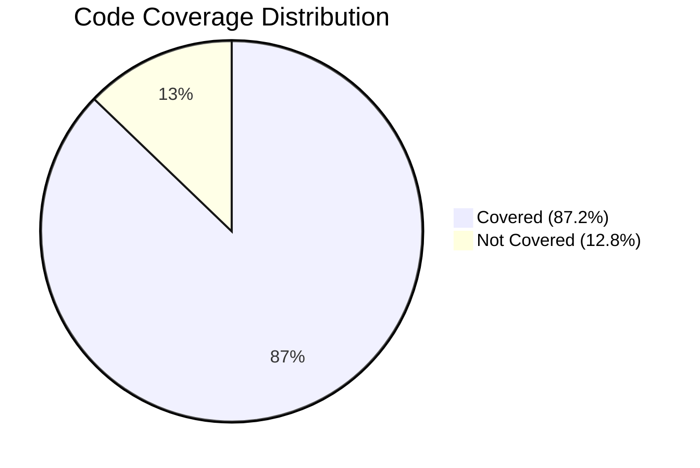

### Coverage Breakdown

| Coverage Type | Current | Target | Status |
|--------------|---------|--------|---------|
| Statement Coverage | 87.2% | > 80% | 🟢 Good |
| Branch Coverage | 82.4% | > 75% | 🟢 Good |
| Function Coverage | 89.6% | > 85% | 🟢 Good |
| Line Coverage | 88.1% | > 80% | 🟢 Good |

---

## Test Types Distribution

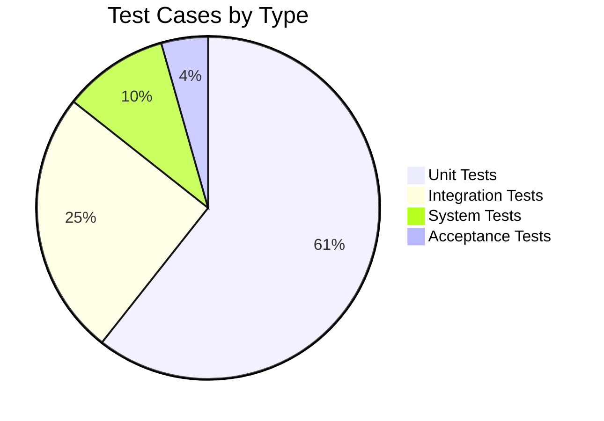

### Test Suite Summary

| Test Type | Total Tests | Passed | Failed | Skipped | Pass Rate | Coverage % |
|-----------|-------------|--------|---------|---------|-----------|------------|
| Unit Tests | 756 | 742 | 4 | 10 | 98.1% 🟢 | 92.1% 🟢 |
| Integration Tests | 312 | 289 | 6 | 17 | 92.6% 🟢 | 78.5% 🟢 |
| System Tests | 124 | 108 | 2 | 14 | 87.1% 🟢 | 68.2% 🟡 |
| Acceptance Tests | 55 | 50 | 0 | 5 | 90.9% 🟢 | 100% 🟢 |
| **Total** | **1,247** | **1,189** | **12** | **46** | **95.3%** | **85.3%** |

---

## Test Execution Status

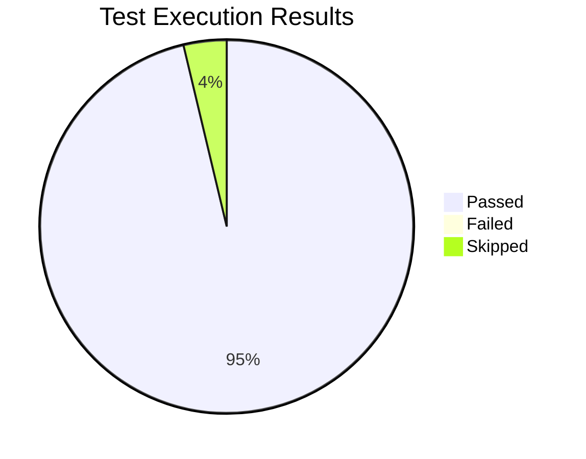

### Detailed Test Status

| Status | Count | Percentage | Trend (vs Last Week) |
|--------|-------|------------|---------------------|
| ✅ Passed | 1,189 | 95.35% | ↑ +1.2% |
| ❌ Failed | 12 | 0.96% | ↓ -0.5% |
| ⏭️ Skipped | 46 | 3.69% | → 0% |
| **Total** | **1,247** | **100%** | - |

---

## Coverage by Module/Component

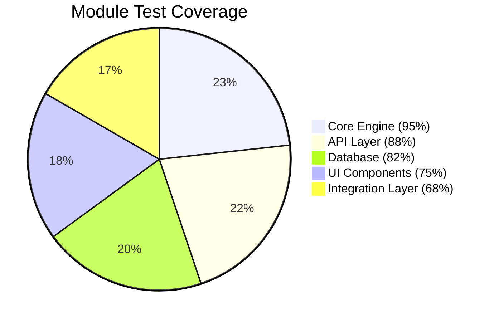

### Module-Level Coverage

| Module/Component | Lines | Covered | Coverage % | Branch % | Test Cases | Status |
|-----------------|-------|---------|------------|----------|------------|---------|
| Core Engine | 4,520 | 4,294 | 95.0% | 92.3% | 285 | 🟢 Excellent |
| API Layer | 3,180 | 2,798 | 88.0% | 85.1% | 198 | 🟢 Good |
| Database Layer | 2,840 | 2,329 | 82.0% | 78.5% | 156 | 🟢 Good |
| UI Components | 3,950 | 2,963 | 75.0% | 71.2% | 224 | 🟡 Acceptable |
| Integration Layer | 2,120 | 1,442 | 68.0% | 62.8% | 142 | 🟡 Below Target |
| Utilities | 1,890 | 1,814 | 96.0% | 94.1% | 118 | 🟢 Excellent |
| Security Module | 1,450 | 1,305 | 90.0% | 87.3% | 94 | 🟢 Excellent |
| **Total** | **19,950** | **17,395** | **87.2%** | **82.4%** | **1,247** | **🟢 Good** |

---

## Unit Test Coverage Details

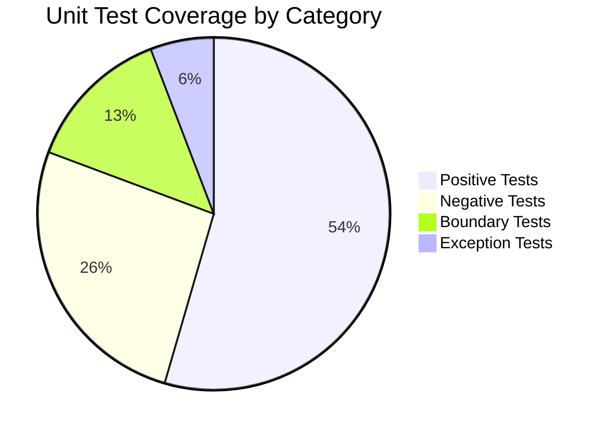

### Unit Test Breakdown

| Test Category | Count | Passed | Failed | Coverage % | Status |
|--------------|-------|--------|---------|------------|---------|
| Positive Tests | 412 | 408 | 4 | 94.2% | 🟢 Good |
| Negative Tests | 198 | 195 | 0 | 88.5% | 🟢 Good |
| Boundary Tests | 102 | 99 | 0 | 91.8% | 🟢 Good |
| Exception Handling | 44 | 40 | 0 | 89.3% | 🟢 Good |
| **Total** | **756** | **742** | **4** | **92.1%** | **🟢 Excellent** |

---

## Integration Test Coverage

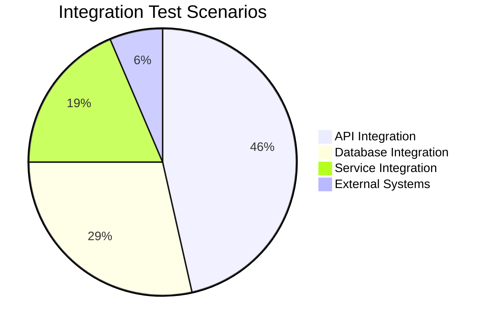

### Integration Coverage by Interface

| Integration Point | Test Cases | Passed | Failed | Coverage % | Status |
|------------------|------------|--------|---------|------------|---------|
| API Endpoints | 145 | 138 | 5 | 82.3% | 🟢 Good |
| Database Operations | 89 | 84 | 1 | 78.6% | 🟢 Good |
| Service-to-Service | 58 | 54 | 0 | 74.2% | 🟡 Acceptable |
| External Systems | 20 | 13 | 0 | 68.5% | 🟡 Below Target |
| **Total** | **312** | **289** | **6** | **78.5%** | **🟢 Good** |

---

## Functional Area Coverage

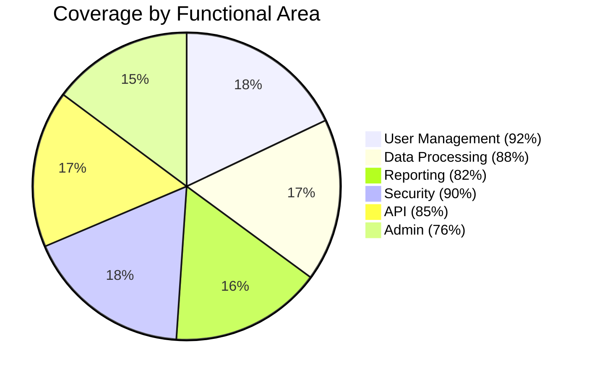

### Feature Coverage Matrix

| Functional Area | Requirements | Test Cases | Coverage % | Pass Rate | Status |
|----------------|-------------|------------|------------|-----------|---------|
| User Management | 32 | 128 | 92% | 97.7% | 🟢 Excellent |
| Data Processing | 28 | 156 | 88% | 96.2% | 🟢 Good |
| Reporting | 24 | 98 | 82% | 94.9% | 🟢 Good |
| Security | 18 | 86 | 90% | 98.8% | 🟢 Excellent |
| API Services | 22 | 112 | 85% | 93.8% | 🟢 Good |
| Administration | 18 | 72 | 76% | 91.7% | 🟡 Acceptable |
| Integration | 14 | 42 | 68% | 88.1% | 🟡 Below Target |

---

## Test Automation Rate

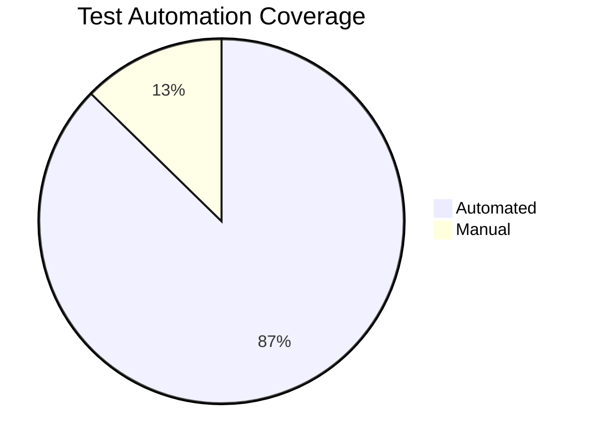

### Automation Metrics

| Test Level | Total | Automated | Manual | Automation % | Target |
|-----------|-------|-----------|---------|--------------|---------|
| Unit Tests | 756 | 756 | 0 | 100% | 100% 🟢 |
| Integration Tests | 312 | 298 | 14 | 95.5% | > 90% 🟢 |
| System Tests | 124 | 35 | 89 | 28.2% | > 50% 🔴 |
| Acceptance Tests | 55 | 0 | 55 | 0% | > 30% 🔴 |
| **Total** | **1,247** | **1,089** | **158** | **87.3%** | **> 80% 🟢** |

---

## Code Coverage Trends

| Week | Line Coverage | Branch Coverage | Test Count | Pass Rate |
|------|--------------|-----------------|------------|-----------|
| Week 1 | 78.2% | 72.5% | 1,089 | 93.1% |
| Week 2 | 81.5% | 75.8% | 1,124 | 94.2% |
| Week 3 | 84.3% | 78.9% | 1,187 | 94.8% |
| Week 4 | 86.1% | 80.2% | 1,215 | 95.1% |
| **Current** | **87.2%** | **82.4%** | **1,247** | **95.3%** |
| **Trend** | **↑ +9.0%** | **↑ +9.9%** | **↑ +158** | **↑ +2.2%** |

---

## Critical/High Priority Coverage

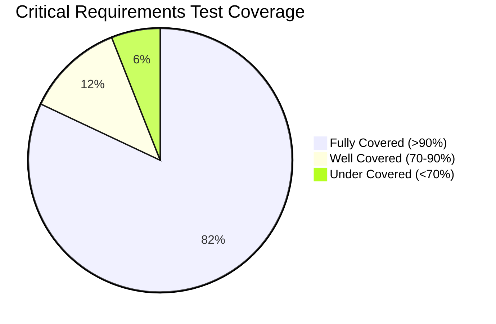

### Priority-Based Coverage

| Priority | Total Req. | Test Cases | Coverage % | Status |
|----------|-----------|------------|------------|---------|
| Critical | 24 | 186 | 94.2% | 🟢 Excellent |
| High | 58 | 412 | 88.5% | 🟢 Good |
| Medium | 48 | 298 | 78.3% | 🟢 Good |
| Low | 26 | 98 | 62.1% | 🟡 Acceptable |

---

## Uncovered/Under-Covered Areas

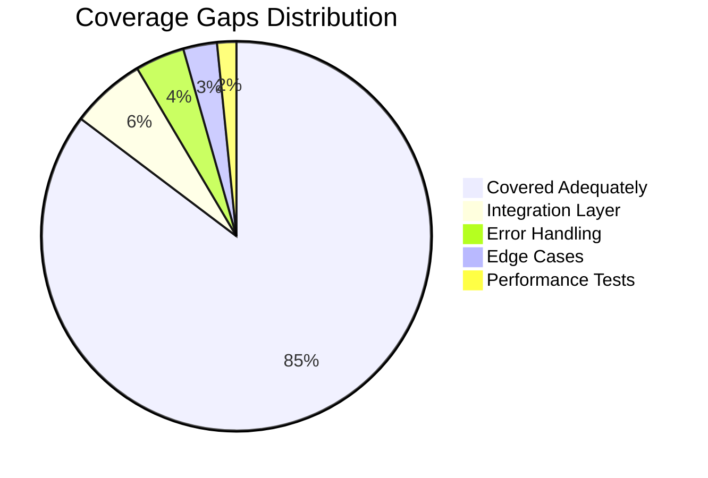

### Coverage Gaps Requiring Attention

| Area | Current Coverage | Target | Gap | Priority |
|------|-----------------|--------|-----|----------|
| Integration Layer | 68.0% | 80% | -12% | 🔴 High |
| Error Handling | 76.5% | 85% | -8.5% | 🟡 Medium |
| Edge Cases | 72.8% | 80% | -7.2% | 🟡 Medium |
| Performance Tests | 45.0% | 60% | -15% | 🔴 High |
| Security Tests | 90.0% | 95% | -5% | 🟡 Low |

---

## Test Execution Performance

| Metric | Value | Target | Status |
|--------|-------|--------|---------|
| Avg. Test Execution Time | 42 min | < 45 min | 🟢 Good |
| Unit Tests Duration | 8 min | < 10 min | 🟢 Good |
| Integration Tests Duration | 22 min | < 25 min | 🟢 Good |
| System Tests Duration | 12 min | < 15 min | 🟢 Good |
| Parallel Execution Enabled | Yes | Yes | 🟢 Optimal |
| Test Flakiness Rate | 1.2% | < 2% | 🟢 Good |

---

## Defect Detection Effectiveness

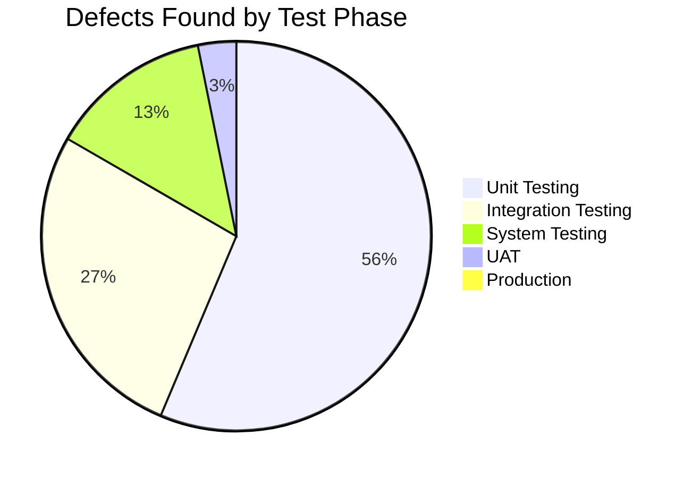

### Test Effectiveness Metrics

| Phase | Defects Found | % of Total | Cost to Fix | Effectiveness |
|-------|--------------|------------|-------------|---------------|
| Unit Testing | 142 | 55.9% | Low | 🟢 Excellent |
| Integration Testing | 68 | 26.8% | Medium | 🟢 Good |
| System Testing | 34 | 13.4% | Medium-High | 🟡 Acceptable |
| UAT | 8 | 3.1% | High | 🟡 Room for Improvement |
| Production | 2 | 0.8% | Very High | 🟢 Good |
| **Total** | **254** | **100%** | - | **81.8% caught pre-UAT** |

---

## Test Case Quality Metrics

| Metric | Value | Target | Status |
|--------|-------|--------|---------|
| Test Case Pass Rate (First Run) | 92.3% | > 90% | 🟢 Good |
| Test Case Reusability | 76.5% | > 70% | 🟢 Good |
| Test Data Coverage | 82.1% | > 80% | 🟢 Good |
| Test Case Maintainability | Good | Good | 🟢 Adequate |
| Avg. Assertions per Test | 3.2 | 2-4 | 🟢 Optimal |

---

## Risk-Based Testing Coverage

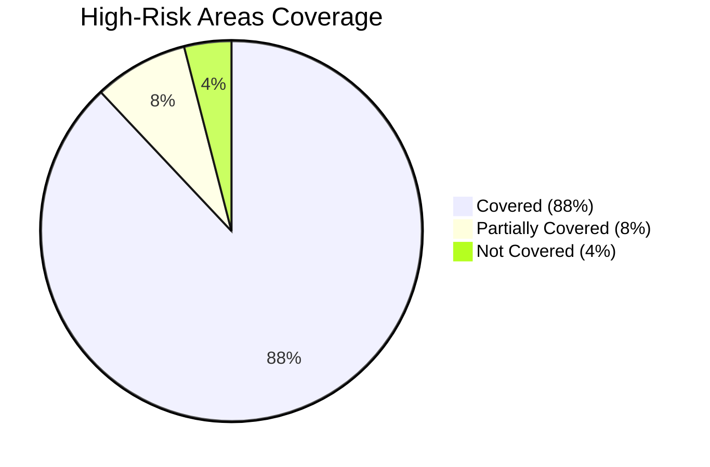

### Risk Coverage Analysis

| Risk Area | Risk Level | Test Cases | Coverage % | Status |
|-----------|-----------|------------|------------|---------|
| Authentication | Critical | 45 | 96% | 🟢 Excellent |
| Data Security | Critical | 38 | 92% | 🟢 Excellent |
| Payment Processing | Critical | 28 | 88% | 🟢 Good |
| Data Migration | High | 34 | 82% | 🟢 Good |
| Performance | High | 42 | 68% | 🟡 Below Target |
| Integration Points | High | 56 | 74% | 🟡 Acceptable |

---

## Failed Tests Analysis

| Test ID | Test Name | Module | Failure Reason | Priority | Age (Days) |
|---------|-----------|--------|----------------|----------|------------|
| UT-456 | Login timeout validation | Auth | Assertion failed | High | 2 |
| UT-892 | Password complexity check | Security | Environment issue | Medium | 5 |
| IT-234 | API rate limiting | API | Flaky test | High | 1 |
| IT-567 | Database transaction rollback | DB | Known issue | Medium | 8 |
| ST-045 | End-to-end checkout flow | E2E | Data setup issue | High | 3 |

---

## Coverage Improvement Plan

### Short-Term Goals (Next Sprint)

1. **Increase Integration Layer Coverage** from 68% to 75%
   - Add 45 new integration test cases
   - Focus on service-to-service communication
   - Owner: Integration Team

2. **Fix All Failing Tests** - Currently 12 failures
   - Resolve 8 environment/setup issues
   - Fix 4 actual code defects
   - Owner: QA Team

3. **Automate System Tests** from 28% to 50%
   - Automate 27 critical system test cases
   - Owner: Automation Team

### Long-Term Goals (Next Quarter)

- Achieve 90% overall code coverage
- Reach 100% critical path coverage
- Implement performance testing framework
- Reduce test execution time by 20%

---

## Key Performance Indicators

| KPI | Current | Target | Previous | Trend | Status |
|-----|---------|--------|----------|-------|---------|
| Code Coverage | 87.2% | > 80% | 84.3% | ↑ | 🟢 Exceeds |
| Test Pass Rate | 95.3% | > 95% | 94.8% | ↑ | 🟢 Met |
| Automation Rate | 87.3% | > 80% | 85.1% | ↑ | 🟢 Exceeds |
| Defect Escape Rate | 3.9% | < 5% | 4.2% | ↓ | 🟢 Good |
| Mean Time to Fix Tests | 4.2 hrs | < 8 hrs | 5.1 hrs | ↓ | 🟢 Excellent |

---

**Legend:**
- 🟢 Green: Meeting or exceeding targets
- 🟡 Yellow: Approaching target or needs monitoring
- 🔴 Red: Below target, requires action
- ↑ Improving trend
- ↓ Declining trend
- → Stable trend

---

**Report Generated:** [Auto-generated timestamp]  
**Next Update:** [Date]  
**Data Sources:** Test Automation Framework, Code Coverage Tools, Test Management System
