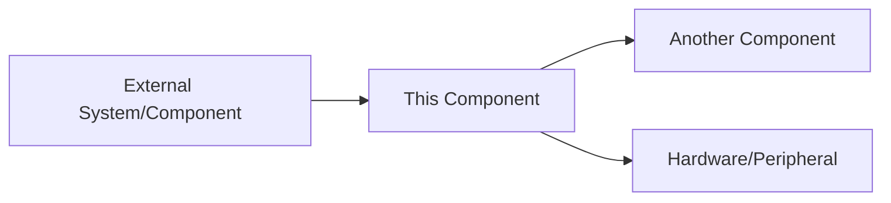
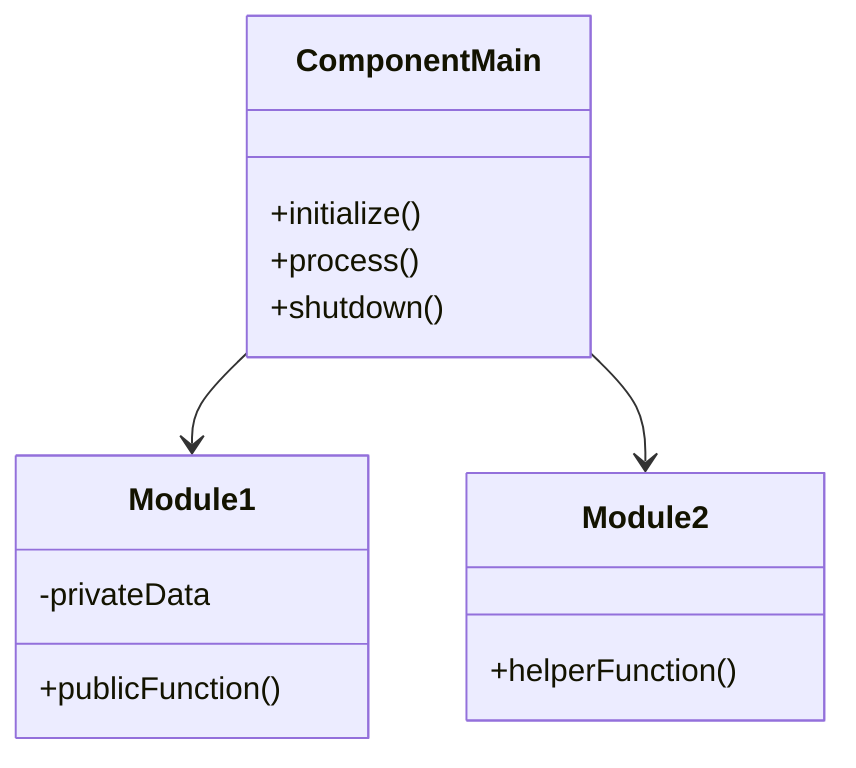
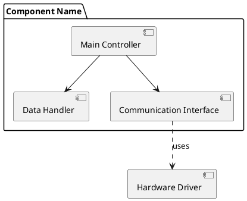
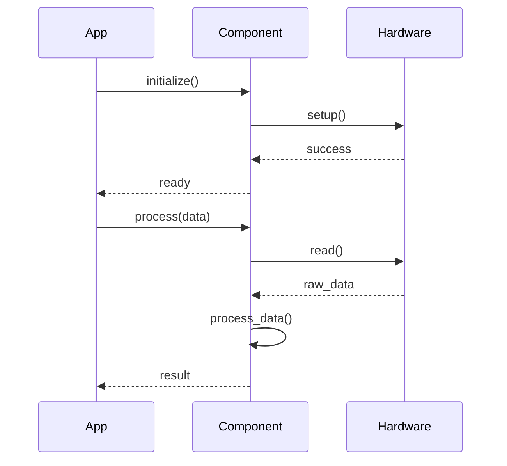
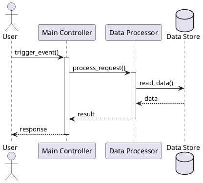
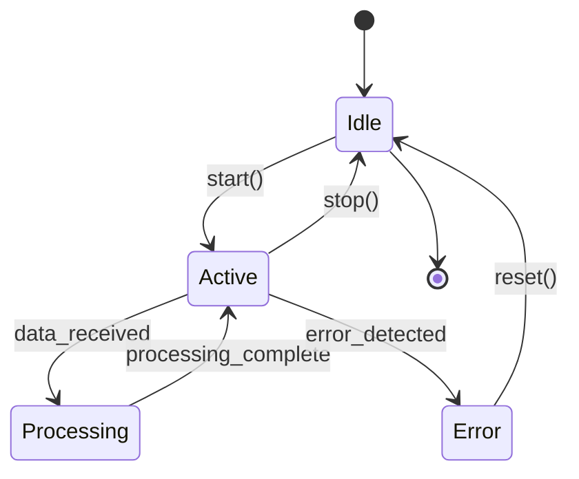
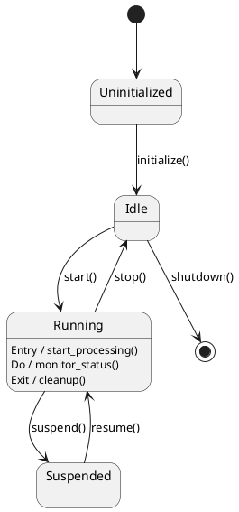

# Overview

This document consolidates the requirements and design of all components running in Raspberry Pi

_Last updated: {{ git_revision_date_localized }}_

-----

!!! danger "⚠️ TEMPLATE - DO NOT USE AS-IS"
    **This is a template file.** Copy and customize for your own use. The content below is placeholder text only and should not be considered as actual documentation
    
## Component Name

### Component Overview

Brief description of the component's purpose and responsibility in the system.

**Purpose:** What problem does this component solve?

**Scope:** What is included and what is out of scope?

**Key Responsibilities:**
- Responsibility 1
- Responsibility 2
- Responsibility 3

---

### Component Requirements

List the functional and non-functional requirements this component must satisfy.

#### Functional Requirements
- FR1: Requirement description
- FR2: Requirement description
- FR3: Requirement description

#### Non-Functional Requirements
- NFR1: Performance requirement (e.g., response time, throughput)
- NFR2: Resource constraints (e.g., memory, CPU usage)
- NFR3: Reliability/Safety requirements
- NFR4: Other constraints (e.g., real-time requirements, power consumption)

---

### Design

High-level design approach and how this component fits into the overall system architecture.

**Design Approach:** Brief explanation of the chosen design strategy

**System Context:** How does this component interact with other components?



**Key Design Decisions:**
- Decision 1 and rationale
- Decision 2 and rationale

---

### Static View

Structure of the component - modules, files, classes, functions, and their relationships.

#### Module Structure
```
component_name/
├── src/
│   ├── main.c
│   ├── module1.c
│   └── module2.c
├── inc/
│   ├── module1.h
│   └── module2.h
└── config/
    └── config.h
```

#### Component Diagram (Mermaid example)


#### Component Diagram (PlantUML example)


#### Key Interfaces
**Public API:**
```c
// Function signatures and brief descriptions
void component_init(config_t* config);
status_t component_process(data_t* input, data_t* output);
void component_shutdown(void);
```

---

### Runtime View

Behavior and interactions during execution - sequences, timing, state transitions.

#### Sequence Diagram (Mermaid example)


#### Sequence Diagram (PlantUML example)


#### State Machine (Mermaid example)


#### State Machine (PlantUML example)


#### Timing Constraints
- Constraint 1: Description (e.g., must respond within 10ms)
- Constraint 2: Description (e.g., periodic execution every 100ms)

---

### Alternative Design Decisions

Document the design alternatives considered and explain why they were not chosen.

#### Alternative 1: [Name of Alternative]
**Description:** Brief description of the alternative approach

**Pros:**
- Advantage 1
- Advantage 2

**Cons:**
- Disadvantage 1
- Disadvantage 2

**Reason for Rejection:** Why this alternative was not selected

---

#### Alternative 2: [Name of Alternative]
**Description:** Brief description of the alternative approach

**Pros:**
- Advantage 1
- Advantage 2

**Cons:**
- Disadvantage 1
- Disadvantage 2

**Reason for Rejection:** Why this alternative was not selected

---

### Notes and References

- Note 1: Additional information or constraints
- Note 2: Links to related documentation
- Reference 1: Standards, specifications, or external documentation
