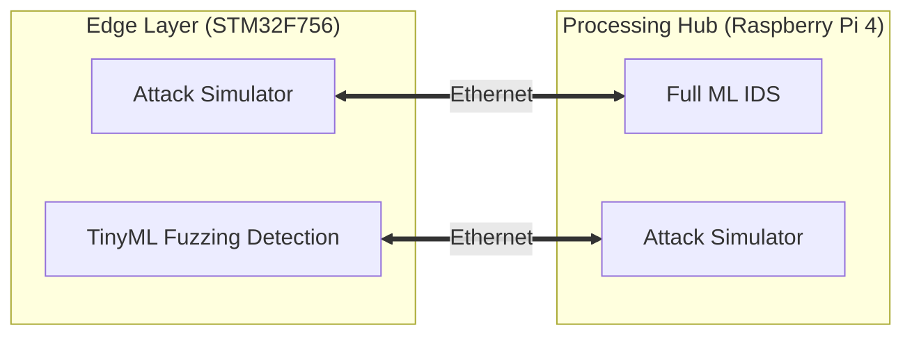

# Network Intrusion Detection System with TinyML

**Status:** 🟢 Phase 1 - In Progress  
**Version:** 0.1.0-dev

_Last updated: {{ git_revision_date_localized }}_

-----

## 🧭 **Project Navigation**

- **[Getting Started](General/For_Contributors.md)** - Setup your environment
- **[Build your Own](General/For_Replicators.md)** - If you like to create your own project in similar style
- **[Tools Installation](General/tools_installation.md)** - Required software
- **[GitHub Repository](https://github.com/Sivaram91/Network-IDS-project)** - Source code
- **[Project Board](https://github.com/users/Sivaram91/projects/2/views/2)** - Task tracking
- **[Software Process Documentation](General/ASPICE_V_Model.html)** - V-Model (SWE1-SWE6)
- **[Project Planning](General/Release_Planning.md)** - Milestones & Roadmap
- **[Knowledge Base](KnowledgeBase/HomePage.md)** - Pre-requisite to understand and work on this project
- **[Lessons Learnt](LessonsLearnt/00_LessonsLearnt.md)** - My personal learnings from this project
- **[How-To Guides](General/HowTos.md)**
- **[FAQs](General/FAQs.md)**

-----

## 📋 **Project Overview**

A dual-layer security system combining Machine Learning and TinyML for real-time network intrusion detection, with applications in automotive and IoT security.

## 🎯 **Mission**

- **AI-Orchestrated System Engineering**  
To design and build this entire project by strategically leveraging AI assistants such as Claude, ChatGPT, and Copilot for architecture, code generation, test design, documentation, and system modeling — positioning myself not as a traditional coder, but as a system engineer who effectively orchestrates AI tools to deliver structured engineering outcomes efficiently.

- **Hands-on AI Technology Enablement**  
To deeply understand modern AI technologies by applying them in real engineering scenarios rather than studying them theoretically.

- **AI for Automotive Cybersecurity**  
To explore and implement AI-driven techniques within the context of automotive cybersecurity, aligning with my professional domain expertise.

- **Embedded & Edge Intelligence Exploration**  
To experiment with deploying AI models in embedded environments, integrating traditional embedded systems with intelligent edge computing.

- **Linux & Adaptive AUTOSAR Practical Learning**  
To gain hands-on exposure to Linux-based systems and Adaptive AUTOSAR concepts relevant to next-generation automotive architectures.

- **Process-Centric Engineering Demonstration**  
To structure the project using strong engineering processes, ensuring clarity, traceability, modularity, and self-understandability for external readers.

- **Self-Contained Knowledge System**  
To organize all artifacts — architecture, decisions, test cases, and documentation — so that the project explains itself without external guidance.

- **RAG-Based Intelligent Project Guide**  
To build a Retrieval-Augmented Generation (RAG) system using the project's own documentation, transforming it into an interactive AI-assisted guide.

- **AI-Created, AI-Implemented, AI-Explained**  
To establish a unique project paradigm: an AI implementation engineered using AI tools, and ultimately documented and explained by an AI-powered knowledge system.

## 🏗️ **System Overview**

**Left Side (Edge):** Fuzzing detection using TinyML (<100KB model)  
**Right Side (Cloud):** Full network traffic analysis using ML

-----

## 🛠️ **Technology Stack**

### **Hardware**

|Component |Model |Purpose |
|---------------------|--------------------|----------------------------|
|Microcontroller |STM32F756ZG (NUCLEO)|Gateway + TinyML |
|Single Board Computer|Raspberry Pi 4 (8GB)|Full ML + IDS |
|Connectivity |Ethernet + WiFi |Device communication + cloud|

### **Software**

|Layer |Technology |Purpose |
|------------|---------------------|-------------------|
|ML Framework|Scikit-learn |Model training (Pi)|
|TinyML |TensorFlow Lite Micro|Inference (STM32) |
|Network |Scapy |Packet capture |
|Language |Python 3.9+ |Pi development |
|Embedded |C |STM32 firmware |
|CI/CD |GitHub Actions |Automation |

-----

## 📅 **Project Phases**

### ✅ Phase 0: Planning (Complete)

- [x] Setting up Github Repo
- [x] Setting up Github Pages for Documentation
- [x] Creating a Framework for Documentation
- [x] Requirements definition  
- [x] Hardware selection & Procurement

### 🔄 Phase 1: Core Functionality (Current - Weeks 1-6)

- [ ] Raspberry Pi IDS implementation  
- [ ] STM32 TinyML implementation  
- [ ] System integration  
- [ ] Testing & validation  

### ⏳ Phase 2: Professional Infrastructure (Weeks 7-10)

- CI/CD pipeline  
- Comprehensive documentation  
- Demo video  
- Portfolio preparation  

### ⏳ Phase 3: Cloud Integration (Future)

- WiFi connectivity  
- Real-time dashboard (Grafana)  
- Alert system  
- Remote monitoring  

### ⏳ Phase 4: AUTOSAR & Advanced Features (Future)

- Classic AUTOSAR (STM32)  
- Adaptive AUTOSAR (Pi)  
- Yocto Linux  
- Secure FOTA system  

### ⏳ Phase 5: RAG Documentation Assistance (Future)

- Natural language Q&A 
- Public demo  
- Integrated with project portfolio  

-----

## 🎯 **Success Criteria**

**Phase 1 Goals:**

- [ ] Detect 3+ attack types with >90% accuracy
- [ ] False positive rate < 5%
- [ ] TinyML model < 100KB
- [ ] Real-time latency < 100ms
- [ ] Complete test coverage

-----

## 👤 **About**

**Author:** Sivaramasubramanian Sundararaj  
**Background:** 13+ years embedded software development | AUTOSAR architect | Bootloader specialist  
**Location:** Gärtringen, Germany  
**Email:** sivaram.07@gmail.com 

-----

## 📄 **License**

Educational and portfolio project.  
Copyright © 2026 Sivaramasubramanian Sundararaj
